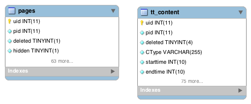
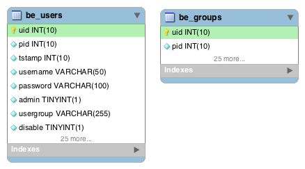
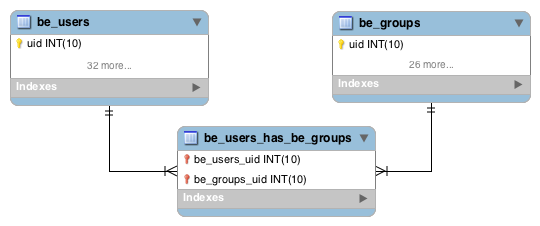

## Aktuelle Situation
In Kapitel~\ref{basics:typo3:subsubsec:coreAndApi} wurde bereits darauf hingewiesen, dass TYPO3 CMS eine einheitliche Datenbank API anbietet. Diese wird durch die Klasse \phpinline{\TYPO3\CMS\Core\Database\DatabaseConnection} bereitgestellt und ist über die globale Variable \phpinline{$GLOBALS['TYPO3_DB']} verfügbar. Sie bietet Methoden zum Lesenden und Schreibenden Zugriff auf die Datenbank an. 

\begin{listing}
\begin{phpcode}
$GLOBALS['TYPO3_DB']->exec_UPDATEquery(
  $this->user_table,
  $this->userid_column . '=' . $this->db->fullQuoteStr($tempuser[$this->userid_column], $this->user_table),
  array($this->lastLogin_column => $GLOBALS['EXEC_TIME'])
			);

\end{phpcode}
\caption{Aktualisierung des Zeitpunkt des letzten Logins}
\label{lst:databaseOldExample}
\end{listing}

Durch die Nutzung der Datenbank API wird zum einen die Integrität der Daten sichergestellt und zum anderen eine Abstraktionsebene zwischen TYPO3 CMS und der Datenbank eingeführt. Durch die Vermeidung der direkten Nutzung der von MySQL beziehungsweise von MySQLi zur Verfügung gestellten Datenbankfunktionen wird eine Abhängigkeit zu MySQL vermieden. Allerdings stellt die Datenbank API keine Datenbankabstraktionsschicht dar. Diese wird durch die Systemextension DBAL implementiert. Mehr dazu im Kapitel~\ref{extdbal}.

Die Datenbank API bietet eine Vielzahl an Methoden die sich in die folgenden fünf Gruppen einteilen lassen.

\begin{enumerate}
\item Die erste Gruppe besteht aus Methoden, die anhand der übergebenen Parametern einen SQL-Query generieren. Damit werden die typischen CRUD-Operationen~\ref{ft:crud}) abgebildet.

\begin{figure}[H]
    \centering
    \includegraphics[scale=0.75]{gfx/uml/DatabaseConnectionCreationMethods.eps}
    \caption{DatenbankConnection mit den generierenden Methoden}
    \label{fig:databaseConnectionWithSQLGenerationMethods}
\end{figure}

Folgendes Codebeispiel aus \phpinline{\TYPO3\CMS\Core\Authentication\AbstractUserAuthentication} zeigt die Funktionsweise von \phpinline{SELECTquery()}. Der Kommentar zeigt die generierte SQL-Query.

\begin{listing}
\begin{phpcode}
// DELETE FROM sys_file_reference WHERE tablenames='pages';
$deleteQuery = $GLOBALS['TYPO3_DB']->DELETEquery(
					'sys_file_reference',
					'tablenames=' . $GLOBALS['TYPO3_DB']->fullQuoteStr('pages', 'sys_file_reference')
				);

\end{phpcode}
\caption{Löschen eines Datensatzes aus einer Tabelle}
\label{lst:databaseOldDeleteExample}
\end{listing}

\item Eine Ebene höher setzt die nächste Gruppe an, die die eben gezeigen Methoden nutzt und den generierten SQL-Query ausführt und eine Ergebnismenge vom Typ \phpinline{mysqli_result} zurückliefert.

\begin{figure}[H]
    \centering
    \includegraphics[scale=0.75]{gfx/uml/DatabaseConnectionExecuteMethods.eps}
    \caption{DatenbankConnection mit den ausführenden Methoden}
    \label{fig:databaseConnectionWithSQLExecutionMethods}
\end{figure}

\item In der dritte Gruppe befinden sich die Methoden, die im weitesten Sinn zur Verarbeitung der Ergebnismenge genutzt werden. Darunter fallen 

- jene die die Daten aus der Ergebnismenge extrahieren
- die für die Fehlerbehandlung genutzt werden können, 
- sowie Methoden die Informationen über die Ergebnismenge breitstellen

\begin{figure}[H]
    \centering
    \includegraphics[scale=0.75]{gfx/uml/DatabaseConnectionFetchMethods.eps}
    \caption{DatenbankConnection: Methoden zur Verarbeitung der Ergebnismenge}
    \label{fig:databaseConnectionWithResultsetsMethods}
\end{figure}

\item Die nächste Gruppe besteht aus Hilfsmethoden, die genutzt werden um 

- einen SQL-Query an die Datenbank zu senden
- Benutzereingaben zu maskieren
- Listen von Integern zu normalisieren
- eine \phpinline{WHERE}-Bedingung aus Komma-separierten Datensätzen zu erzeugen

\begin{figure}[H]
    \centering
    \includegraphics[scale=0.75]{gfx/uml/DatabaseConnectionHelperMethods.eps}
    \caption{DatenbankConnection: Hilfsmethoden}
    \label{fig:databaseConnectionWithHelperMethods}
\end{figure}

\item Die letzte Gruppe besteht aus einer Reihe von Methoden, die verschiedene Metadaten über die Datenbank zur Verfügung stellen. Der Name impliziert, dass sie für Administrative Tätigkeiten genutzt werden, was jedoch irreführend ist. Sie werden hauptsächlich während der Installation vom \textit{Installation Tool} verwendet, um Informationen über die zugrundeliegende Datenbank zu erhalten}

\begin{figure}[H]
    \centering
    \includegraphics[scale=0.75]{gfx/uml/DatabaseConnectionAdminMethods.eps}
    \caption{DatenbankConnection mit administrativen Methoden}
    \label{fig:databaseConnectionWithSQLAdminMethods}
\end{figure}

\end{enumerate}

Aus historischen Gründen nutzt die Datenbank API die prozedualen MySQLi Funktionen anstelle der Objekt-orientierten API von MySQLi. Dadurch stellt \phpinline{\TYPO3\CMS\Core\Database\DatabaseConnection} kein Verbindungsobjekt dar - wie zum Beispiel \phpinline{PDO} - sondern eine Sammlung an Datenbankfunktionen. Dadurch gibt es auch kein Objekt, welches die Ergebnismenge repräsentiert, was \phpinline{\TYPO3\CMS\Core\Database\DatabaseConnection} zu einer recht große Klasse mit 1950 Zeilen Code und 76 Methoden.

Im Gegensatz dazu steht die Anzahl von 9 UnitTests für diese Klasse, die lediglich ein paar Hilfsmethoden testen. Es ist somit nicht sichergestellt, ob die Methoden das tun, was sie vorgeben zu tun. In den letzten Monaten wurde jedoch ein Framework für Funktionale Tests in TYPO3 CMS integriert, so dass die Methoden immerhin indirekt getest werden.

[Und dass obwohl TYPO3 CMS mit aktuell 5527 Unit Tests und 8667 Assertions schon eine recht gute Testabdeckung hat 27% der Dateien und 36% der abgedeckten Zeilen]

### Prepared Statements
Seit TYPO3 CMS 4.5 können Prepared Statements für \mysqlinline{SELECT} Anweisungen verwendet werden. TYPO3 CMS unterstützt sowohl \textit{Posistional Parameters} wie auch \textit{Named Parameters}.

\begin{listing}
\begin{phpcode}
$statement = $GLOBALS['TYPO3_DB']->prepare_SELECTquery('*', 'bugs', 'reported_by = ? AND bug_status = ?');
$statement->execute(array('goofy', 'FIXED'));

$statement = $GLOBALS['TYPO3_DB']->prepare_SELECTquery('*', 'bugs', 'reported_by = :nickname AND bug_status = :status');
$statement->execute(array(':nickname' => 'goofy', ':status' => 'FIXED'));
\end{phpcode}
\caption{Positional und Named Prepared Statements der TYPO3 CMS Datenbank API}
\label{lst:databaseOldPreparedStatement}
\end{listing}

\phpinline{\TYPO3\CMS\Core\Database\DatabaseConnection::prepare_SELECTquery} liefert ein Objekt der Klasse \phpinline{\TYPO3\CMS\Core\Database\PreparedStatement} zurück, welches sich an der API von \gls{pdo} orientiert.

\begin{figure}[H]
    \centering
    \includegraphics[scale=0.75]{gfx/uml/PreparedStatement.eps}
    \caption{Die Klasse PreparedStatement mit ausgewählen Methoden}
    \label{fig:selectedMethodsOfPreparedStatements}
\end{figure}

### Datenbankschema

Nach der Installation von TYPO3 CMS beinhaltet die Datenbank rund 60 einzelne Tabellen. Die Anzahl hängt von der Installation der optionalen Systemextensions ab.

Wichtige Tabellen sind:
\begin{itemize}
\item pages – Enthält die Seiten 
\item tt_content – Enthält die Inhaltselement, die auf den Seiten dargestellt werden
\item be_groups / fe_groups – Enhält die Backend- beziehungsweise die Frontendgruppen
\item be_users / fe_users – enthält die Backend- beziehungsweise die Frontendbenutzer
\end{itemize}

Dazu kommen Tabellen 
\begin{itemize}
\item die gecachte Daten und Sessions beinhalten, 
\item die der Indexierung des Inhalts dienen 
\item sowie zum Protokollieren von Systemereignissen
\end{itemize}

Die Inhalte werden in TYPO3 CMS in einer Dateisystem ähnlichen Baumstruktur verwaltet. Eine Webseite wird darin durch einen Datensatz vom Typ \textit{Seite} repräsentiert. Dieser Datensatz hat eine ID, die im gleichnamigen Feld in der Tabelle \texttt{pages} gespeichert wird. Diese ist der \textit{Unique Identifier} des Datensatzes.

Die Inhalte einer Webseite wie Texte, Bilder oder Formulare werden innerhalb einer Seite abgelegt. TYPO3 CMS bietet hierzu eine breite Palette von verschiedenen Elementen an. Zudem können Plugins und wiederum Seiten innerhalb eines Seitendatensatzes abgelegt werden. Diese Liste kann unbegrenzt fortgeführt werden, da jede Extension neue Elemente eingeführen kann, welches in einer Seite ablegbar sind. Es ist lediglich wichtig zu wissen, dass Datensätze innnerhalb von Seiten abgelegt werden können. Die Inhaltselemente werden hauptsächlich in der Tabelle \texttt{tt_content} gespeichert beziehungsweise in den Tabellen, die die Extension vorsieht.

\begin{figure}[H]
    \centering
    \includegraphics[scale=0.75]{diagrams/DatabasePagesTTContent.eps}
    \caption{Die Tabellen pages und tt_content}
    \label{fig:pagesAndTTContent}
\end{figure}

Die Verknüpfung von Inhaltselement zu übergeordneter Seite erfolgt in der Datenbank über die Spalte \phpinline{pid} (PageID), in der die ID der übergeordneten Seite als Fremdschlüssel gespeichert wird. Listing~\ref{lst:getSubpages} zeigt die SQL-Abfrage, die alle Unterseiten einer Seite zurückgibt. Dabei hat die Seite, dessen Unterseiten abgefragt werden, die \texttt{uid} 4, die in die Abfrage eingesetzt wird. Die Anfrage lautet: Wähle alle Datensätze aus der Tabelle \texttt{pages}, die in der Spalte \texttt{pid} eine 4 stehen haben.

\begin{listing}
\begin{phpcode}
SELECT * FROM pages WHERE pid=4 ORDER BY sorting
\end{phpcode}
\caption{Abrufen von Unterseiten einer Seite}
\label{lst:getSubpages}
\end{listing}

Analog zum vorigen Listing, zeigt das Folgende die SQL-Anfrage, die alle Inhaltselemente von der Datenbank abfragt.

\begin{listing}
\begin{phpcode}
SELECT * FROM tt_content WHERE pid=4 ORDER BY sorting
\end{phpcode}
\caption{Abrufen von Inhaltselementen einer Seite}
\label{lst:getContentElements}
\end{listing}

Die beiden Abfragen geben alle Datensätze zurück, was in der Realität jedoch meistens nicht gewünscht ist. Zum Beispiel sollen keine gelöschten Datensätze angezeigt oder nicht alle Inhaltselemente ausgegeben werden. Datensätze werden in der Datenbank nicht gelöscht, sondern in der Spalte \textit{deleted} durch das setzen des Wertes auf 1 als gelöscht markiert. Inhaltselemente werden über die Spalte \texttt{CType} nach ihrem Typ gefiltert. Um das gewünschte Ergebnis zu erhalten müssen \mysqlinline{WHERE}-Klauseln formuliert werden, was die doch recht trivialen SQL-Anfragen schnell komplex werden lässt.

In TYPO3 CMS können die Benutzerrechte sehr granular eingestellt werden. Die Einstellungen können per Benutzer oder Benutzergruppe vorgenommen werden.
Dabei kann ein Benutzer Mitglied keiner, einer oder mehrerer Benutzergruppen sein. Zudem kann eine Benutzergruppe keinen, einen oder mehrere Benutzer enthalten. Dies stellt eine Many-to-Many-Relation dar.

In der Datenbank wird die Zugehörigkeit von Benutzer <-> Gruppe von den Tabellen \texttt{fe_users} und \texttt{fe_groups} beziehungweise \texttt{be_users} und \texttt{be_groups} abgebildet. 

\begin{figure}[H]
    \centering
    \includegraphics[scale=0.75]{diagrams/DatabaseBEUserGroup.eps}
    \caption{Die Tabellen be_users und be_groups}
    \label{fig:beUsersAndBeGroups}
\end{figure}

Hier fällt der Datentyp der Spalte \texttt{usergroup} auf, die ID der Gruppe des Benutzers speichert. Hier ist ein \mysqlinline{VARCHAR} definiert, obwohl die Spalte \texttt{uid} den Typ \mysqlinline{INT} hat. Dies liegt darin, dass die Zuordnung der Benutzer zu Gruppe über eine kommaseparierte Liste erfolgt:

\begin{Verbatim}[samepage=true]
	+----+-----+------------+----------+----------+-------+-----------+---------+--------+---------+
    | id | pid |   tstamp   | username | password | admin | usergroup | disable | hidden | deleted |
	+----+-----+------------+----------+----------+-------+-----------+---------+--------+---------+
	|  1 |  0  | 1191353353 | admin    |  secret  |   1   |           |    0    |   0    |    0    | 
	|  2 |  0  | 1281556682 | snape    |  secret  |   1   |    43     |    0    |   0    |    0    |
	|  3 |  0  | 1191353353 | hagrid   |  secret  |   0   |  5,32,43  |    0    |   1    |    0    |
	+----+-----+------------+----------+----------+-------+-----------+---------+--------+---------+
\end{Verbatim}

\begin{tabular}[H]
\begin{tabluarx}{\textwidth}{|X|X|X|X|X|X|X|X|X|X|}
\hline
uid & pid & tstamp & username & password & admin & usergroup & disable & hidden & deleted \\ \hline
1 & 0 & 1191353353 & admin           & secret & 1 &         & 0 & 0 & 0\\ \hline
2 & 0 & 1281556682 & stefano.kowalke & secret & 1 &     43  & 0 & 0 & 0\\ \hline
3 & 0 & 1191353353 & admin           & secret & 0 & 5,32,43 & 1 & 0 & 0\\ \hline
\end{tabular}
\caption{Auszug aus der \texttt{be_users} Datenbanktabelle}
\end{tabluarx}

Diese stellt lediglich ein Beispiel dar. Kommaseparierte Listen gibt es an vielen Stellen in der Datenbank. Die API von TYPO3 CMS stellt Methoden bereit, die die Liste für die weitere Verabreitung aufbereiten.

Dieses Konstrukt existiert wahrscheinlich seit Beginn des Systems und es ist zu vermuten, dass damit eine Many-to-Many-Tabelle vermieden werden sollte, was die Komplexität der SQL-Anfrage erhöht. 

Um die kommaseparierten Listen aufzulösen, müßte eine weitere Tabelle eingeführt werden, dessen zwei Spalten jeweils auf die \texttt{id} der beiden zu verknüfenden Tabellen referenzieren.

\begin{figure}[H]
    \centering
    \includegraphics[scale=0.75]{diagrams/DatabaseBEUserGroupMM.eps}
    \caption{Normalisierung über Many-to-Many Tabelle}
    \label{fig:beUsersHasBeGroups}
\end{figure}

\begin{tabular}[H]
\begin{tabluarx}{\textwidth}{|X|X|}
\hline
be_users_uid & be_groups_uid \\ \hline
2 & 43 \\ \hline
3 & 5 \\ \hline
3 & 32\\ \hline
3 & 43\\ \hline
\end{tabular}
\caption{Auszug aus der \texttt{be_users_has_be_groups} Datenbanktabelle}
\end{tabluarx}

TYPO3 CMS nutzt weder Datenbankseitige \textit{Constraints} noch Fremdschlüssel Definitionen. Alle Referenzierungen werden von TYPO3 CMS selbst verwaltet.

### Ideas
- Prepared Statements im Core √
- DatabaseConnection -> Einstiegspunkt für alles √
- wird in einer globalen Variable $GLOBALS['TYPO3_DB'] vorgehalten -> überall verfügbar √
- globales Array ist nicht so gut -> besser die Einbindung per Dependency Injection
- lange Klasse √
- nur minimale UnitTests für DatabaseConnection vorhanden √
- Namen der Methoden folgen nicht der CGL
- kein richtiges Query Objekt √
- keine Unterscheidung zwischen Verbindung / Query / Result √
- Aufbau der Datenbank
  - welche Tabellen gibt es √
  - Comma-Seperated-Lists √
  - keine Constraints genutzt -> da Legacy √

### From Dimitrys Book
- muß vom Core un ddern Extension genustz werden √
- Codebeispiele wie die API genutzt werden kann / soll einfügen √
- Beispiele aus dem Core nehmen √
- Methoden ähnlen den von MySQL, dass ist gewollt, da dies das Standard DBMS für TYPO3 ist
- Einteilung der SQL-FUnktionen √
  - zum erstellen von Anfragen √
  - zum Ausführen von Anfragen √
  - zum fetch von Ergebnissen √
  - zum Erhalt der Anzahl der Rows √
  - Hilfsfunktionen √
  - zur Manipulation der Anfrage √
