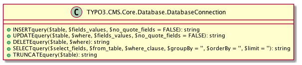
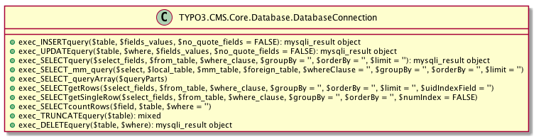
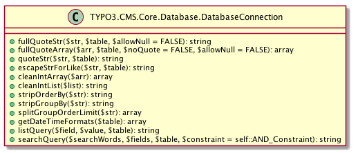
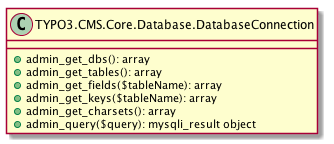

## Aktuelle Situation
In Kapitel~\ref{basics:typo3:subsubsec:coreAndApi} wurde bereits darauf hingewiesen, dass TYPO3 CMS eine einheitliche Datenbank API anbietet. Diese wird durch die Klasse **\TYPO3\CMS\Core\Database\DatabaseConnection** bereitgestellt und ist über die globale Variable \phpinline{$GLOBALS['TYPO3_DB'] verfügbar. Sie bietet Methoden zum Lesenden und Schreibenden Zugriff auf die Datenbank an. 

listing
phpcode
$GLOBALS['TYPO3_DB']->exec_UPDATEquery(
  $this->user_table,
  $this->userid_column . '=' . $this->db->fullQuoteStr($tempuser[$this->userid_column], $this->user_table),
  array($this->lastLogin_column => $GLOBALS['EXEC_TIME'])
			);

phpcode
\caption{}
\label{lst:databaseOldExample}
listing

Durch die Nutzung der Datenbank API wird zum einen die Integrität der Daten sichergestellt und zum anderen eine Abstraktionsebene zwischen TYPO3 CMS und der Datenbank eingeführt. Durch die Vermeidung der direkten Nutzung der von MySQL beziehungsweise von MySQLi zur Verfügung gestellten Datenbankfunktionen wird eine Abhängigkeit zu MySQL vermieden. Allerdings stellt die Datenbank API keine Datenbankabstraktionsschicht dar. Diese wird durch die Systemextension DBAL implementiert. Mehr dazu im Kapitel~\ref{extdbal}.

Die Datenbank API bietet eine Vielzahl an Methoden die sich in fünf Gruppen einteilen lassen:

Die erste Gruppe besteht aus Methoden, die anhand der übergebenen Parametern einen SQL-Query generieren. Damit werden die typischen CRUD-Operationen~\ref{ft:crud}) abgebildet.

Folgendes Codebeispiel aus \phpinline{\TYPO3\CMS\Core\Authentication\AbstractUserAuthentication} zeigt die Funktionsweise von \phpinline{SELECTquery()}. Der Kommentar zeigt die generierte SQL-Query.

listing
phpcode
// DELETE FROM sys_file_reference WHERE tablenames='pages';
$deleteQuery = $GLOBALS['TYPO3_DB']->DELETEquery(
					'sys_file_reference',
					'tablenames=' . $GLOBALS['TYPO3_DB']->fullQuoteStr('pages', 'sys_file_reference')
				);

phpcode
\caption{}
\label{lst:databaseOldSelectExample}
listing

Eine Ebene höher setzt die nächste Gruppe an, die die eben gezeigen Methoden nutzt und den generierten SQL-Query ausführt und eine Ergebnismenge vom Typ \phpinline{mysqli_result} zurückliefert.

In der dritte Gruppe befinden sich die Methoden, die im weitesten Sinn zur Verarbeitung der Ergebnismenge genutzt werden. Darunter fallen 

- jene die die Daten aus der Ergebnismenge extrahieren
- die für die Fehlerbehandlung genutzt werden können, 
- sowie Methoden die Informationen über die Ergebnismenge breitstellen

Die nächste Gruppe besteht aus Hilfsmethoden, die genutzt werden um 

- einen SQL-Query an die Datenbank zu senden
- Benutzereingaben zu maskieren
- Listen von Integern zu normalisieren
- eine \phpinline{WHERE}-Bedingung aus Komma-separierten Datensätzen zu erzeugen

Die letzte Gruppe besteht aus einer Reihe von Methoden, die verschiedene Metadaten über die Datenbank zur Verfügung stellen. Der Name impliziert, dass sie für Administrative Tätigkeiten genutzt werden, was jedoch irreführend ist. Sie werden hauptsächlich während der Installation vom \textit{Installation Tool} verwendet, um Informationen über die zugrundeliegende Datenbank zu erhalten}

Die Datenbank API nutzt im Wesentlichen die Datenbankfunktionen, die von MySQLi zur Verfügung gestellt werden. Dabei wird aus historischen Gründen die prozeduale API von MySQLi verwendert und nicht die Objekt-orientierte.

### Prepared Statements
Seit TYPO3 CMS 4.5 können Prepared Statements für \mysqlinline{SELECT} Anweisungen verwendet werden. TYPO3 CMS unterstützt sowohl \textit{Posistional Parameters} wie auch \textit{Named Parameters}.

listing
phpcode
$statement = $GLOBALS['TYPO3_DB']->prepare_SELECTquery('*', 'bugs', 'reported_by = ? AND bug_status = ?');
$statement->execute(array('goofy', 'FIXED'));

$statement = $GLOBALS['TYPO3_DB']->prepare_SELECTquery('*', 'bugs', 'reported_by = :nickname AND bug_status = :status');
$statement->execute(array(':nickname' => 'goofy', ':status' => 'FIXED'));
phpcode
\caption{}
\label{lst:databaseOldPreparedStatement}
listing

**\TYPO3\CMS\Core\Database\DatabaseConnection::prepare_SELECTquery** liefert ein Objekt der Klasse **\TYPO3\CMS\Core\Database\PreparedStatement** zurück, welches die ähnliche Methoden beinhaltet, die bereits im Kapitel über Prepared Statements in Verbindung mit Doctrine DBAL beschrieben wurden.

Im Unterschied zu Doctrine DBAL, bei dem die Werte separat an die Datenbank gesendet und erst gegen die Platzhalter in der SQL-Anweisung ausgetauscht werden, geht TYPO3 CMS einen eigenen Weg - es ersetzt die Platzhalter selbst und sendet die fertige Anweisung an die Datenbank. Das bedeutet, dass die von TYPO3 CMS implementierten Prepared Statements lediglich vorgeben Prepared Statements zu sein. Wahrscheinlich wurden sie präventiv eingeführt um eines Tages echte Prepared Statements nutzen zu können. Als Version 4.5 veröffentlicht wurde, nutze die Datenbank API noch die Funktionen der Datenbankerweiterung MySQL, die keine Prepared Statements unterstützen. Die API wurde erst im März 2013 auf MySQLi umgestellt.\footnote{\url{https://forge.typo3.org/issues/36419}}. 

### Datenbankschema

Sie wird im weiteren Verlauf als \textit{Datenbank API} bezeichnet. Die Datenbank API kapselt alle Methoden zur Interaktion mit der Datenbank und muß vom Systemkern und den Extension genutzt werden um die Integrität der Datenbank zu gewährleisten. Wie im Kapitel über DBAL~\ref{dbal} erläutert wird, Zudem ist durch Nutzung der Datenbank API sichergestellt, dass der SQL-Code auch mit anderen DBMS funktioniert. Zudem kann sich die Implementation der API ändern, wenn zum Beispiel von MySQL auf MySQLi umgestellt wurde.

### Ideas
- Prepared Statements im Core
- DatabaseConnection -> Einstiegspunkt für alles
- wird in einer globalen Variable $GLOBALS['TYPO3_DB'] vorgehalten -> überall verfügbar
- globales Array ist nicht so gut -> besser die Einbindung per Dependency Injection
- nur minimale UnitTests für DatabaseConnection vorhanden
- Namen der Methoden folgen nicht der CGL
- kein richtiges Query Objekt
- keine Unterscheidung zwischen Verbindung / Query / Result
- Aufbau der Datenbank
  - welche Tabellen gibt es
  - Comma-Seperated-Lists
  - keine Constraints genutzt -> da Legacy

### From Dimitrys Book
- Database API most independend
- muß vom Core un ddern Extension genustz werden
- Codebeispiele wie die API genutzt werden kann / soll einfügen
- Beispiele aus dem Core nehmen
- Methoden ähnlen den von MySQL, dass ist gewollt, da dies das Standard DBMS für TYPO3 ist
- Einteilung der SQL-FUnktionen
  - zum erstellen von Anfragen
  - zum Ausführen von Anfragen
  - zum fetch von Ergebnissen
  - zum Erhalt der Anzahl der Rows
  - Hilfsfunktionen
  - zur Manipulation der Anfrage
