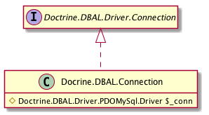
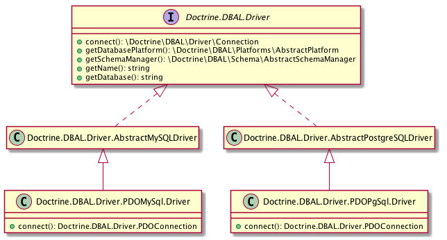
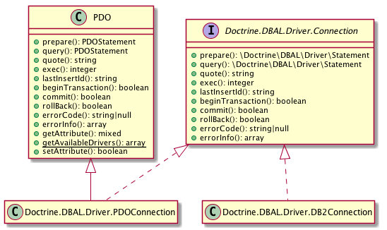
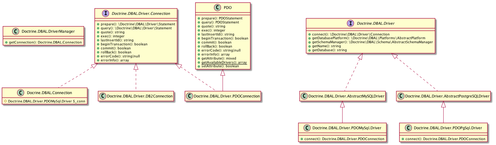

\section{Doctrine}
Das Doctrine Projekt besteht aus einer Reihe von PHP-Bibliotheken, die Schnittstellen rund um die Datenbankschicht bereitstellen. Die Konzepte sind beeinflusst von Javas \textit{Hibernate}\footnote{\url{http://hibernate.org/}} (vgl. \cite{web:t3nDoctrine2009}) und dem Entwurfsmuster \textit{Active Record}, welches von Martin Fowler \cite{book:fowlerPatterns2003} vorgestellt wird.

Das Projekt wurde 2006 von Konsta Vesterinen initiiert\footnote{\url{http://docs.doctrine-project.org/projects/doctrine1/en/latest/en/manual/acknowledgements.html}} und im Jahr 2008 als Version 1.0.0 veröffentlicht. Die Version 2.0 wurde im Jahr 2010 unter dem neuen Projektleiter Benjamin Eberlei fertiggestellt.

Die beiden bekanntesten Produkte des Projekts sind:
\begin{itemize}
	\item \gls{orm} - ermöglicht die objekrelationale Abbildung von Objekten auf Datenbanktabellen
	\item \gls{dbal} - stellt eine Datenbankabstraktionsschicht bereit
\end{itemize}

Wie aus Abbildung~\ref{fig:doctrineArchitecture} ersichtlich wird, ist Doctrine DBAL lediglich als eine dünne Schicht auf Basis der \gls{php}-Extension \gls{pdo} ausgeführt, die die grundlegenden Funktionen zur Abstraktion von Datenbanken implementiert. Die ORM Schicht baut auf Doctrine DBAL auf.

\begin{figure}[H]
    \centering
    \includegraphics[scale=0.75]{diagrams/DoctrineArchitecture.eps}
    \caption{Schematischer Aufbau von Doctrine}
    \label{fig:doctrineArchitecture}
\end{figure}

\subsection{ORM}
\begin{shadequote}[l]{Jonathan Wage \cite{web:t3nDoctrine2009}}
	Ein ORM ist eine Abstraktionsschicht zwischen relationaler Datenbank und der eigentlichen Anwendung. Statt per SQL kann man durch das ORM objektorientiert auf die Daten zugreifen.
\end{shadequote}

Das folgende Anwendungsbeispiel zeigt eine typische Situation. Es wird zunächst ein neues Objekt eines Studenten erzeugt um im weiteren Verlauf mit verschiedenen Daten angreichert. Anschließend wird es als zu speicherndes Objekt bei der Datenbank registiert und schlußendlich gespeichert.

Im zweiten Codelisting wird die gleiche Aufgabe auf dem herkömmlichen Weg gelöst. Dabei wird die Anfrage an eine MySQL und PostgreSQL Datenbank gesendet. Die Variable \phpinline{$connection} enthält je eine initialisierte Verbindung zur entsprechenden Datenbank.

\begin{listing}
\begin{phpcode}
<?php

$student = new Student();
$student->setFirstName('Stefano');
$student->setLastName('Kowalke');
$student->setEnrolmentNumber('12345');
$entityManager->persist($student);
$entityManager->flush();
\end{phpcode}
\caption{Speichern eines Studenten in die Datenbank mit ORM}
\label{lst:orm}
\end{listing}

\begin{listing}
\begin{phpcode}
<?php

$sql =
    'INSERT INTO students ('first_name', 'last_name', 'enrolment_number')
    VALUES ('Stefano', 'Kowalke', '12345');

// MySQLi
$result = mysqli_query($connection, $sql);

// PostgreSQL
$result = pg_query($connection, $sql);

\end{phpcode}
\caption{Speichern eines Studenten in die Datenbank ohne ORM}
\label{lst:withoutOrm}
\end{listing}

Der Code in Listing~\ref{lst:orm} gibt keinen Rückschluss auf die darunterliegende Datenbank. Die Daten des Studenten könnten in eine CSV-Datei, einer MySQL oder Postgres Datenbank gespeichert worden sein. Hingegen wurden in Listing~\ref{lst:withoutOrm} zwei verschiedene Methoden genutzt, um die Daten in eine MySQL und Postgres Datenbank zu schreiben. Die Speicherung in eine Textdatei wurde dabei nicht berücksichtigt.

Doctrine ORM ist für die Umwandlung des \phpinline{$student}-Objekt in eine \gls{sql}-Abfrage zuständig. Die erzeugte Abfrage ist mit der aus Codebeispiel~\ref{lst:withoutOrm} vergleichbar. Die Konvertierung der Anfrage in die verschiedenen \gls{sql}-Dialekte\footnote{Als \gls{sql} Dialekt wird ein vom \gls{sql}-Standard abweichender Hersteller-spezifischer Sprachumfang bezeichnet. Ein Dialekt ist in der Regel kompatibel mit dem Standard und erweitert ihn um eigene Sprachkonstrukte.} erfolgt durch Doctrine DBAL.

\subsection{DBAL}
Doctrine konvertiert das Schema anhand von sehr unterschiedlichen Merkmalen in das \gls{sql} der jeweilgen \gls{dbms}, die zum Verständnis einen etwas tieferen Einstieg in die Eigenheiten der \gls{dbms} erfordern. Da dies den Umfang der Arbeit überschreitet, wurden markante Beispiele gewählt, die den Sachverhalt verdeutlichen.

Datenbankschemas werden in Doctrine von der Klasse \phpinline{Schema} repräsentiert. Im Beispiel wird zunächst eine Instanz dieser Klasse erstellt und anschließend wird eine neue Tabelle und mehrere Tabellenspalten mit unterschiedlichen Datentypen angelegt. In Zeile 24 wird das Schema in eine \gls{sql}-Abfrage übersetzt. Davor existiert es lediglich als PHP-Objekt bis zum Ende der Laufzeit des Scripts.

Die Variable \phpinline{$myPlatform} enthält die Information über das aktuelle benutzte \gls{dbms}.

\begin{listing}[H]
\begin{phpcode}
<?php

$schema = new \Doctrine\DBAL\Schema\Schema();
$beUsers = $schema->createTable('be_users‘);
$beUsers->addColumn('uid', 'integer',
  array('unsigned' => TRUE, 'notnull' => TRUE, 'autoincrement' => TRUE)
);
$beUsers->addColumn('pid', 'integer',
  array('unsigned' => TRUE, 'default' => '0', 'notnull' => TRUE)
);
$beUsers->addColumn('username', 'string',
  array('length' => 50, 'default' => '', 'notnull' => TRUE)
);
$beUsers->addColumn('password', 'string',
  array('length' => 100, 'default' => '', 'notnull' => TRUE)
);
$beUsers->addColumn('admin', 'boolean',
  array('default' => '0', 'notnull' => TRUE)
);
$beUsers->addColumn('history_data', 'text',
  array('length' => 16777215, 'notnull' => FALSE)
);
$beUsers->addColumn('ses_data', 'text',
  array('notnull' => FALSE)
);
$beUsers->setPrimaryKey(array('uid'));
$beUsers->addIndex(array('pid'), 'be_users_pid_idx');
$beUsers->addIndex(array('username'), 'be_users_username');

$queries = $schema->toSql($myPlatform);
\end{phpcode}
\caption{Erstellen eines Schemas mit Doctrine}
\label{lst:createSchema}
\end{listing}

Die beiden Listings \ref{lst:mysqlFromSchema} und \ref{lst:pgsqlFromSchema} zeigen den Inhalt von \phpinline{$queries} – einmal für MySQL und für PostgreSQL.

\begin{listing}[H]
\begin{mysqlcode}
// Der Inhalt von $queries für MySQL
CREATE TABLE `be_users` (
	`uid` int(10) unsigned NOT NULL AUTO_INCREMENT,
	`pid` int(10) unsigned NOT NULL DEFAULT '0',
	`username` varchar(50) COLLATE utf8_unicode_ci NOT NULL DEFAULT '',
	`password` varchar(100) COLLATE utf8_unicode_ci NOT NULL DEFAULT '',
	`admin` tinyint(1) NOT NULL DEFAULT '0',
	`history_data` mediumtext,
	`ses_data` longtext,
	PRIMARY KEY (`uid`),
	KEY `be_users_pid_idx` (`pid`),
	KEY `be_users_username` (`username`)
) ENGINE=InnoDB AUTO_INCREMENT=2 DEFAULT CHARSET=utf8 COLLATE=utf8_unicode_ci;
\end{mysqlcode}
\caption{Das erstellte Schema als MySQL Anfrage}
\label{lst:mysqlFromSchema}
\end{listing}

\begin{listing}[H]
\begin{psqlcode}
// Der Inhalt von $queries für PostgreSQL
CREATE TABLE be_users (
	uid serial NOT NULL,
	pid integer NOT NULL DEFAULT 0,
	username character varying(50) NOT NULL DEFAULT ''::character varying,
	password character varying(100) NOT NULL DEFAULT ''::character varying,
	admin boolean NOT NULL DEFAULT false,
	history_data text,
	ses_data text,
	CONSTRAINT be_users_pkey PRIMARY KEY (uid)
) WITH (
	OIDS=FALSE
);
\end{psqlcode}
\caption{Das erstellte Schema als PostgreSQL}
\label{lst:pgsqlFromSchema}
\end{listing}

Anhand der Beispiele können folgende Konvertierungen abgeleitet werden:

\begin{table}[H]
	\begin{tabularx}{\textwidth}{|X|X|p{0.26\textwidth}|}
		\hline
		Abstraktion                             & MySQL                                  & PostgreSQL\\ \hline
		\phpinline{integer ... auto_increment}  & \sqlinline{INT(10) ... AUTO_INCREMENT} & \sqlinline{serial}\\ \hline
		\phpinline{integer}                     & \sqlinline{INT(10)}                    & \sqlinline{INTEGER} \\ \hline
		\phpinline{string ... length => 50}     & \sqlinline{VARCHAR(50)}                & \sqlinline{CHARACTER VARYING(50)} \\ \hline
		\phpinline{boolean}                     & \sqlinline{TINYINT(1)}                 & \sqlinline{BOOLEAN} \\ \hline
		\phpinline{text ... length => 255}      & \sqlinline{TINYTEXT}                   & \sqlinline{TEXT} \\ \hline
		\phpinline{text}                        & \sqlinline{LONGTEXT}                   & \sqlinline{TEXT}\\ \hline
	\end{tabularx}
	\caption{Typkonvertierung von Doctrine nach MySQL und PostgreSQL}
	\label{tab:typeConvertationDoctrine}
\end{table}

Doctrine wählt die entsprechenden Typen anhand verschiedener Kriterien aus.

\begin{itemize}
	\item Angabe von weiteren Optionen: \phpinline{auto_increment}
	\item Angabe einer Länge: \phpinline{length => 50} bzw. \phpinline{length => 255}
	\item Konvertierung in äquivalente Datentypen: MySQL implementiert keinen \sqlinline{BOOLEAN} Typ, daher wird hier \sqlinline{TINYINT(1)} genutzt
\end{itemize}

Dabei ist zu beachten, dass die Werte in Klammern für String-Typen eine andere Bedeutung haben, als für numerische Datentypen. Wird ein \sqlinline{VARCHAR} mit der Länge \textit{34} definiert, bedeutet dies, dass darin eine Zeichenkette mit maximal 34 Zeichen inklusive Leerzeichen gespeichert werden kann. Würde man auf den (vollkommen abwegigen) Gedanken kommen in dieser Spalte das Buch \textit{The Hitchhiker's Guide to the Galaxy} von Douglas Adams speichern zu wollen, würde der Inhalt wie folgt aussehen: ``Far out in the uncharted backwate'' \cite[S. 3]{book:adamsHitchhikers1995}. Der Rest des Textes wird abgeschnitten.

Bei numerischen Datentypen beschreibt der Wert allerdings die Anzeigenbreite - also die Anzahl der angezeigen Ziffern des gespeicherten Wertes. Sollte der in der Spalte gespeicherte Wert kleiner sein als die Länge der Anzeigenbreite, werden die restlichen Stellen nach links mit Leerzeichen aufgefüllt. Wurde die Option \sqlinline{ZEROFILL} gesetzt, werden die restlichen Stellen mit Nullen anstelle von Leerzeichen aufgefüllt. Der Wert beinflusst in keinster Weise den maximal speicherbaren Wert. In einer als \sqlinline{TINYINT} definierten Spalte können immer 256 Werte gespeichert werden. Unabhängig davon ob sie als \sqlinline{TINYINT(1)} oder \sqlinline{TINYINT(4)} deklariert wurde.

Doctrine spiegelt dieses Verhalten wider, indem die Angabe von \phpinline{length} bei der Deklaration eines Integers dem Wert der Anzeigenbreite entspricht; bei String-Typen den tatsächlichen speicherbaren Wertebreich und bei der Deklaration eines Text-Datentyps als Auswahlkriterium in Bezug auf die unterschiedlichen \sqlinline{*TEXT} Datentypen.

\subsection{Verbreitung und ähnliche Projekte}
- Symfony, TYPO3 Flow,
- Propel
- PDO

\subsection{Unterstützte Datenbanken}

\subsection{Konzepte und Architektur von Doctrine}
Doctrine DBAL stellt eine Vielzahl von Funktionen und Objekten zur Verfügung, die in diesen Kapitel erklärt werden. Sie alle sind über Klasse **Doctrine\DBAL\Connection** erreichbar, die zunächst über die Methode **Doctrine\DBAL\DriverManager::getConnection()** instanziiert werden muß. 

**Doctrine\DBAL\Connection** agiert zwar als Verbindung zur Datenbank, ist jedoch lediglich ein Wrapper um die Verbindung, die sich in der internen Objektvariable **$_conn** befindet. Diese Variable enthält ein *Driver*-Objekt und stellt die eigentliche Verbindung dar. Der *Driver* wird anhand der angeforderten Verbindung dynamisch erstellt. Im Fall einer MySQL Datenbank enthält die Variable **$_conn** ein Objekt vom Typ **Doctrine\DBAL\Driver\PDOMySql\Driver**.

**Doctrine\DBAL\Driver\PDOMySql\Driver** erbt von einer Klasse **Doctrine\DBAL\Driver\AbstractMySQLDriver**, die als abstrakte Klasse die Basis für MySQL basierte *Driver* dient. Hier werden die verschiedenen Exceptions zu Doctrine DBAL Exceptions standardisiert und zum anderen Plattform-spezifische Objekte erstellt. Die Klasse implementiert das Interface **Doctrine\DBAL\Driver**, welches die grundlegenden Methoden eines *Driver* definiert. Das Interface muß von jeder *Driver*-Klasse implementiert werden.

**Doctrine\DBAL\Driver\PDOConnection** stellt die eigentliche Verbindung zur Datenbank dar. Die Klasse erbt direkt von **PDO** und überschreibt einige Methoden  - hauptsächlich um sie durch eigene Exceptions zu erweitern. Sie implementiert außerdem das Interface **Doctrine\DBAL\Driver\Connection**. Dieses muß von jeder *Connection*-klasse implementiert werden.

Abbildung \ref{fig:ConnectionAll} zeigt die unmittelbar involvierten Klassen und Interfaces zum erstellen einer Verbindung mit Doctrine DBAL.

Wie zu sehen ist, setzt Doctrine DBAL massiv auf PDO auf. Aus diesem Grund folgt eine kurze Einleitung in PDO und dessen Konzepte. 

Wie in Abbildung~\ref{fig:doctrineArchitecture} zu sehen ist, bildet 

Es kann nicht oft genug darauf hingewiesen werden, dass Doctrine DBAL den Großteil seiner Funktionalität von PDO bezieht.

Die beiden Hauptklassen von Doctrine DBAL sind Connection und Statement, die als eine dünne Schicht über PDO implementiert sind. Doctrine nutzt die Funktionen von PDO und erweitert diese um eigene Funktionaliät.

\begin{figure}[H]
	\centering
	\includegraphics[scale=0.77]{uml/Connection.eps}
	\caption{Schematischer Aufbau von TYPO3}
	\label{fig:typo3Architecture}
\end{figure}

1. [UML Diagramm] √
2. Beschreibung der beiden Klassen
3. Beschreibung von PDO
4. BEschreibung der gemeinsammen Konzepte

dd

- UML Diagramm von Statement mit Verbindung zu PDO
- UML Diagramm von Connection mit Verbindung zu PDO √
- erweitert PDO √