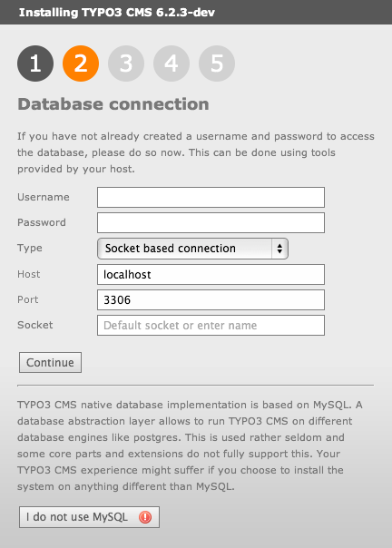
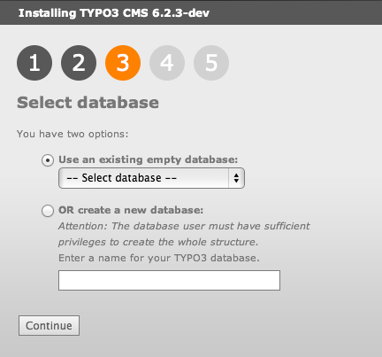
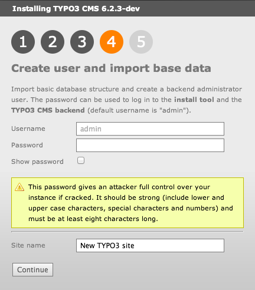
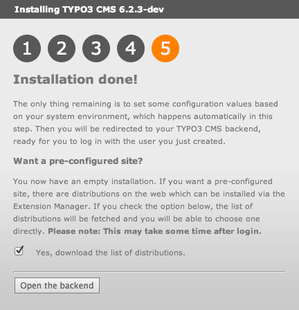
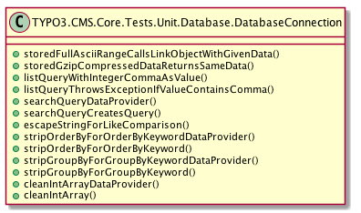
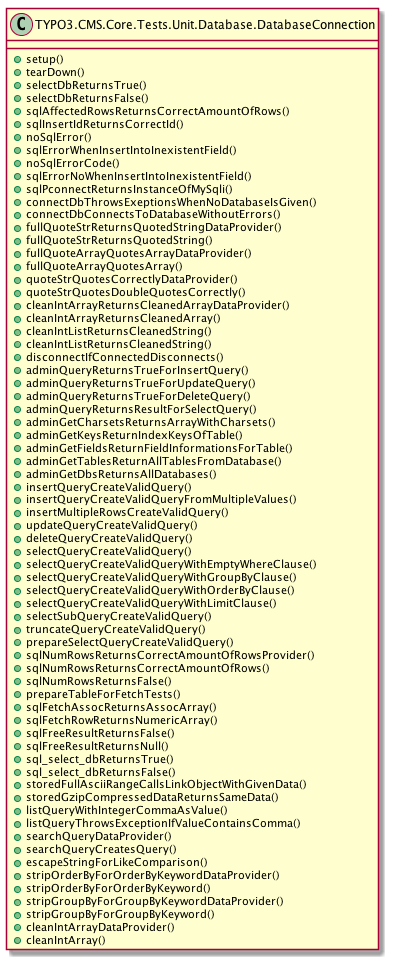
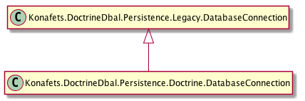

# Prototypischer Nachweis der Herstellbarkeit

Die Erstellung des Prototyps begann mit der Definition verschiedener Zielstellungen. Diese wurden in zusammenhängenden Arbeitspaketen zusammengefasst und dienten als Meileinsteine. 

## Vorüberlegungen
Die Extension wurde als normale Extension konzipiert, die dennoch durch das \textit{Install Tool} installierbar sein muß. Dieser Anforderung ist notwendig, da bereits bei der Installation das zu nutzende \gls{dbms} auswählbar sein muß. 

Desweiteren muß die Extension weiterhin die alte API unterstützen, damit TYPO3 CMS und vor allem die Extensions der externen Entwickler weiterhin funktionieren. Dazu zählt auch das von TYPO3 CMS angebotene Prepared Statement, welches intern die Prepared Statements von MySQLi nutzt und die \textit{Named Paramenter} lediglich simuliert. Die Extension wird die Prepared Statement von Doctrine DBAL / PDO nutzen, ohne die alte API zu verändern.

Es wird lediglich die Unterstützung von MySQL als Datenbank angestreb. Ist das Abgeschlossen kann mit einem weiteren \gls{dbms} experimentiert werden.

Die Methodennamen der neuen API folgen der CGL.

Die Erstellung der Basisdatenbank durch Doctrine DBAL und nutzt dessen abstrahierte Schemarepräsentation.

Die Extension wurde zunächst als normale Extension konzipiert, die gegenfalls ohne größeren Aufwand in eine Systemextension umgewandelt werden kann. 

Die Extension führt eine Query Syntax ein, damit auf die manuelle Formulierung von SQL Anfragen verzichtet werden kann. 

Intern werden stets Prepared Statements genutzt

Anfragen in selbst formuliertem SQL sind nicht mehr möglich

Excelsheet erstellen mit den LegacyMethoden und den neuen MethodenNamen, die der CGL folgen

Daraus ergeben sich folgende zusammenhängende Aufgaben, welche zugleich die Meilensteine sind:

1. Erstellen der Extension -> TYPO3 nutzt die Extension als DB Layer
2. Extension ist per Installtool installierbar
3. Extension nutzt Doctrine DBAL
4. Umwandlung der SQL Dateien in Schema Dateien
5. Implementation einer Fluent API
6. Umbau des Cores auf die API 

Ein Großteil dieser Anforderungen ist erreichbar ohne eine Veränderung an TYPO3 CMS vorzunehmen, da die Extension lediglich die neue API als ein Angebot darstellt. Ein massiver Eingriff in den Code von TYPO3 CMS stellt der Meilenstein 6 dar. Hier muß jede Datenbankfunktion auf die neue API umgestellt werden. Bevor das jedoch geschehen kann, müssen minimale Anpassungen an der Installationsroutine von TYPO3 CMS vorgenommen werden. Dabei diente die Systemextension DBAL als Vorbild, da sie ebenfalls während der Installation installierbar sein muß.

## Installation von TYPO3
Zur Installation wurde im lokalen Webroot (\pdf{Sites} auf unter MacOSX) ein Verzeichnis \pdf{thesis.dev/http} angelegt. Dies stellt das Webroot dieser TYPO3 CMS Instanz dar. 

\begin{shcode}
$ cd Sites/
$ mkdir -p thesis.dev/http/
$ cd thesis.dev/
\end{shcode}

TYPO3 wurde per GIT nach \pdf{thesis.dev/typocms} heruntergeladen. Dieses Verzeichnis wurde gewählt, damit der Quellcode von TYPO3 CMS nicht über das Internet erreichbar ist. Das Kommando \shinline{tree} zeigt das Ergebnis.

\begin{shcode}
$ git clone git://git.typo3.org/Packages/TYPO3.CMS.git typo3cms
$ tree -L 1 --dirsfirst typo3cms

typo3cms
├── contrib
├── ext
├── gfx
├── install
├── js
├── mod
├── sysext
├── ajax.php
…
├── tce_file.php
└── thumbs.php

7 directories, 32 files
\end{shcode}

Danach wurde nach \pdf{http} gewechselt und es wurden die notwendigen Symlinks und Verzeichnisse angelegt. \shinline{tree} zeigt die erstellte Verzeichnisstruktur.

\begin{shcode}
$ cd http/
$ ln -s ../typo3cms/ typo3_src
$ ln -s typo3_src/typo3 typo3
$ ln -s typo3_src/index.php index.php

$ mkdir -p fileadmin typo3conf/ext uploads Packages/Library

$ tree -L
.
├── Packages
├── fileadmin
├── index.php -> typo3_src/index.php
├── typo3 -> typo3_src/typo3
├── typo3_src -> ../typo3cms
├── typo3conf
├── typo3temp
└── uploads

7 directories, 1 file
\end{shcode}

Im Anschluß wurde in der Hostdatei ein A-Record der Domain \pdf{thesis.dev} angelegt, welcher auf den lokalen Rechner zeigt.

\shinline{$ sudo sh -c "echo '127.0.0.1 thesis.dev' >> /etc/hosts"}

Zum Schluß wurde ein virtueller Host in der Apache2 Konfiguration angelegt, der auf das Verzeichnis \pdf{thesis.dev/http} zeigt. 

\begin{shcode}
<VirtualHost *:80>¬
  DocumentRoot "~/Sites/thesis.dev/http"¬
  ServerName thesis.dev¬
  ErrorLog "~/Sites/thesis.dev/logs/error_log"¬
  CustomLog "~/Sites/thesis.dev/logs/access_log" common¬
</VirtualHost>
\end{shcode}

Die TYPO3 CMS Installation ist nun über \url{http://thesis.dev/} erreichbar

\begin{shcode}
$ ping thesis.dev
PING thesis.dev (127.0.0.1): 56 data bytes
64 bytes from 127.0.0.1: icmp_seq=0 ttl=64 time=0.118 ms
64 bytes from 127.0.0.1: icmp_seq=1 ttl=64 time=0.100 ms
\end{shcode}

Anschließend wurde eine leere Datenbank erstellt:

\begin{shcode}
mysql -u root -p
MariaDB [(none)]> create database if not exists thesis;
Query OK, 1 row affected (0.01 sec)
MariaDB [(none)]> quit;
\end{shcode}

Durch das Aufrufen von \url{http://thesis.dev/} im Browser wird der Installationsprozess gestartet, der über verschiedene Schritte das System installiert. 

Im ersten Schritt prüft das \textit{Install Tool} ob alle Verzeichnisse und Symlinks angelegt wurden und die entsprechenden Benutzerrechte besitzen. Abbildung~\ref{fig:installLegacyOne}

Im zweiten Schritt werden die Benutzerdaten für die gerade erstellte Datenbank eingegeben. Es kann hier zwischen einer Port- oder Socke-basierten Verbindung ausgewählt werden. Über den Button am Ende der Formulars wird dem System mitgeteilt, dass anstelle der nativen Datenbank API die Systemextension DBAL genutzt werden soll, da TYPO3 CMS ein anderes \gls{dbms} nutzen soll. Die Exension wird daraufhin installiert und in ähnlicher Weise konfiguriert, wie es hier dargestellt wird.Abbildung~\ref{fig:installLegacyTwo}

Nachdem die Verbindungsdaten eingegeben wurden, versucht TYPO3 CMS sich mit dem \gls{dbms} zu verbinden. Gelingt dies, werden alle verfügbaren Datenbanken abgefragt und aufgelistet (Abbildung~\ref{fig:installLegacyThree}). Aus dem Selectfeld kann eine leere Datenbank ausgewählt werden oder es kann eine über das Inputfeld angegeben werden. Durch das Klicken auf die Schaltfläche werden die Basistabellen in der Datenbank angelegt.

In 4. Schritt der Installation wird ein Administrator für die Seite eingerichtet Abbildung~\ref{fig:installLegacyFour} und es kann ein Name für die Seite vergeben werden.

Danach ist die Installation abgeschlossen und über die Schaltfläche gelangt man in das Backend, welches sich nach Eingabe der Logindaten öffnet. Abbildung~\ref{fig:installLegacyFive}

\begin{shcode}
$ cd Sites/
$ mkdir -p thesis.dev/http/
$ cd thesis.dev/
$ git clone git://git.typo3.org/Packages/TYPO3.CMS.git typo3cms
$ tree -L 1 --dirsfirst typo3cms

typo3cms
├── contrib
├── ext
├── gfx
├── install
├── js
├── mod
├── sysext
├── ajax.php
…
├── tce_file.php
└── thumbs.php

7 directories, 32 files

$ cd http/
$ ln -s ../typo3cms/ typo3_src
$ ln -s typo3_src/typo3 typo3
$ ln -s typo3_src/index.php index.php

$ mkdir -p fileadmin typo3conf/ext uploads Packages/Library

$ tree -L
.
├── Packages
├── fileadmin
├── index.php -> typo3_src/index.php
├── typo3 -> typo3_src/typo3
├── typo3_src -> ../typo3cms
├── typo3conf
├── typo3temp
└── uploads

7 directories, 1 file

$ sudo sh -c "echo '127.0.0.1 thesis.dev' >> /etc/hosts"
\end{shcode}

## Tests für die alte Datenbank API
Um zu gewährleisten, dass TYPO3 CMS sowohl mit der alten API - die von dem Prototypen zur Verfügung gesellt wird - als auch mit der neuen API kompatibel ist, müssen Untit Tests für die alte Datenbank API geschrieben werden. 

Zur Ausführung der Unit Tests wird die Extension \textit{PHPUnit} benötigt, welche das gleichnamige Testing Framework \textit{PHPUnit\footnote{\url{http://www.phpunit.de}}} zur Verfügung und einen einen graphischen Testrunner im Backend mitbringt. Sie wird über den Extension Manager installiert.

Die alte Datenbank API verfügt zur dem Zeitpunkt der Erstelltung des Prototypen über 40 Tests mit 49 Assertions, welche jedoch lediglich Hilfsmethoden testen. Abbildung~\ref{fig:testRunnerUnitTestDatabasConnectionLegacyBefore} und~\ref{fig:DatabasConnectionTestLegacyBefore} zeigen die Testabdeckung in Form des Testrunners und als UML Diagramm. Abbildung~\ref{fig:DatabasConnectionTestLegacyAfter} zeigt die gleiche Klasse mit den für den Prototypen implementierten Unit Tests.  

Es wurden 68 Tests für \phpinline{TYPO3\CMS\Core\Database\DatabaseConnection} zugefügt.

  
## Erstellung des Prototypen

### Stichpunkte

_Änderungen am Prototypen_

1. Extension Builder -> Extension erstellen √
3. Verzeichnis Classes/Persistence/Legacy erstellen √
4. Kopieren von DatabaseConnection.php und PreparedStatements.php in das Verzeichnis √
5. Verzeichnis Tests/Persistence/Legacy erstellen √
6. Kopieren von DatabaseConnectionTest.php und PreparedStatementTest.php in das Verzeichnis √
7. Namespaces anpassen Vendor\Extensionname\Persistence\Legacy √
8. Datei ext_localconf.php erstellen und XCLASSEN der beiden Dateien  √
9. Extension installieren √
10. Per Debuggen in der IDE feststellen, ob ByPass funktioniert √
12. Verzeichnis Classes/Persistence/Doctrine/ erstellen  √
13. Datei DatabaseConnection.php in dem Verzeichnis erstellen -> Datei erbt von Classes\Persistence\Legacy\DatabaseConnection.php √
14. Datei PreparedStatemetns.php in dem Verzeichnis erstellen -> Datei erbt von Classes\Persistence\Legacy\PreparedStatements √
16. \Classes\Persistence\Doctrine\DatabaseConnection.php bekommt die neuen Methoden, die auf die die alte API nutzen parent:: √
17. Syncron dazu die Tests schreiben √
18. Refactoring von connectDb() / connectDatabase() √
19. Testen durch Überschreiben von connectDb() in \Classes\Persistence\Doctrine\DatabaseConnection.php √

Die Grundstruktur der Extension wurde in dem Verzeichnis \pdf{thesis/http/typo3conf/ext/doctrine_dbal} erstellt, wobei der letzte Pfadbestandteil den Namen der Extension darstellt. Abbildung~\ref{fig:extensionInitialFolderStructure} zeigt die Verzeichnisstruktur. 

\begin{Verbatim}[samepage=true]
thesis.dev/http/typo3con/ext/
├── doctrine_dbal/
│   ├── Configuration/
│   ├── Resources/
│   ├── ext_emconf.php
│   ├── ext_icon.gif
│   └── ext_tables.php
\end{Verbatim}

Die Datei \pdf{ext_emconf.php} enthält die Metainformationen der Extension, die von dem Extension Manager verarbeitet werden.

\begin{listing}
\begin{phpcode}
<?php
$EM_CONF[$_EXTKEY] = array(
	'title' => 'Doctrine DBAL',
	'description' => 'Doctrine DBAL Integration in TYPO3 CMS',
	'category' => 'be',
	'author' => 'Stefano Kowalke',
	'author_email' => 'blueduck@gmx.net',
	'author_company' => 'Skyfillers GmbH',
	'shy' => 0,
	'priority' => '',
	'module' => 'mod1',
	'state' => 'alpha',
	'internal' => 0,
	'uploadfolder' => 0,
	'createDirs' => '',
	'modify_tables' => '',
	'clearCacheOnLoad' => 0,
	'lockType' => '',
	'version' => '0.1.0',
	'constraints' => array(
		'depends' => array(
			'typo3' => '6.2.0-6.2.99',
		),
		'conflicts' => array('adodb', 'dbal'),
		'suggests' => array(
		),
	),
);
\end{phpcode}
\caption{Die Datei ext_emconf.php}
\label{lst:extEmconf}
\end{listing}

Im nächsten Schritt wurden die Dateien \pdf{DatabaseConnection.php} und \pdf{PreparedStatements} von TYPO3 CMS in den Ordner \pdf{Classes/Persistence/Legacy} der Extension kopiert und dessen Namesspaces angepasst.

TYPO3 CMS erwartet einen Namespace nach dem Muster \phpinline{Vendor\Extensionname\Verzeichnis\zur\Datei}. Dabei stellt \phpinline{Vendor} einen frei wählbaren Bezeichner dar. Für die Extension wurde \phpinline{Konafets} verwendet.

Damit TYPO3 CMS diese Dateien anstelle der Originalen verwendet, müssen diese per XCLASS überschrieben werden. Dazu muß im Verzeichnis des Prototypen eine Datei mit dem Namen ext_localconf.php mit folgendem Inhalt angelegt werden:

\begin{phpcode}
if (!defined('TYPO3_MODE')) {
	die('Access denied.');
}

$GLOBALS['TYPO3_CONF_VARS']['SYS']['Objects']['TYPO3\\CMS\\Core\\Database\\DatabaseConnection'] = array('className' => 'Konafets\\DoctrineDbal\\Persistence\\Legacy\\DatabaseConnection');
$GLOBALS['TYPO3_CONF_VARS']['SYS']['Objects']['TYPO3\\CMS\\Core\\Database\\PreparedStatement'] = array('className' =>  'Konafets\\DoctrineDbal\\Persistence\\Legacy\\PreparedStatement');
\end{phpcode}

Durch die Installation des Protoypen über den Extension Manager werden diese Änderungen wirksam und TYPO3 CMS nutzt die Klassen des Prototypen anstelle der eigenen. Dies kann festgestellt werden, in dem über die \gls{ide} ein Debug-Breakpoint in die Klasse \phpinlin{Konafets\DoctrineDbal\Persistence\Legacy\DatabaseConnection} innerhalb der \phpinlin{connectDB} gesetzt wird. 

Die \gls{ide} verfügt über einen Debug Listener, der auf ein vom Browser gesendetes Token wartet und bei Empfang den Debug Prozess startet. Für den verwendeten Browser \textit{Chrome} ist ein Addon verfügbar, mittels diesem das Senden des Debug-Tokens per Knopfdruck ein- und ausgeschaltet werden kann.

Wird der Browser und die \gls{ide} in den Debug-Modus gesetzt und TYPO3 CMS neugeladen, bleibt das Programm an dem gesetzten Breakpoint stehen. 

Die neue API wird in dem Verzeichnis \pdf{Classes/Persistence/Doctrine} von den Dateien \pdf{DatabaseConnection.php} und \pdf{PreparedStatement.php} repräsentiert, die dazu erstellt wurden. Da die alte API vorerst nicht verändert werden soll, erbt die Klasse \phpinline{\Konafets\DoctrineDbal\Persistence\Doctrine\DatabaseConnection} von der alten Klasse \phpinline{\Konafets\DoctrineDbal\Persistence\Legacy\DatabaseConnection}. 

Dadurch können die Methoden der neuen API in definiert werden. Intern rufen sie die Methoden der Elternklasse auf. 

\begin{phpcode}
class DatabaseConnection extends \Konafets\DoctrineDbal\Persistence\Legacy\DatabaseConnection {
    /**
	 * Select a SQL database
	 *
	 * @return boolean Returns TRUE on success or FALSE on failure.
	 */
	public function selectDatabase() {
		return parent::sql_select_db();
	}

	/**
	 * Connects to database for TYPO3 sites:
	 *
	 * @throws \RuntimeException
	 * @throws \UnexpectedValueException
	 *
	 * @return void
	 * @api
	 */
	public function connectDatabase() {
		parent::connectDB();
	}
\end{phpcode}

Parallel dazu wurden die Unit Tests der alten API nach \pdf{doctrine_dbal/Tests/Persistence/Legacy/} kopiert und an die neue API angepasst. Da die Anfragen an die neue API zu diesem Zeitpunkt von ihr lediglich an die alte API delegiert werden, funktionieren die Unit Tests weiterhin.

Die letzte Aufgabe des ersten Meilensteins bestand aus dem Refactoring der Methode\phpinline{connectDB}. Laut dem Namen der ist sie zuständig für die Etablierung einer Verbindung zur Datenbank. Tatsächlich hat sie

- einen Test durchgeführt, ob eine Datenbank konfiguriert ist
- die Verbindung angefordert
- die konfigurierte Datenbank ausgewählt und
- verschiedene Hooks ausgeführt

Das folgende Listing zeigt die Methode vor dem Refactoring.

\begin{phpcode}
	/**
	 * Connects to database for TYPO3 sites:
	 *
	 * @param string $host Deprecated since 6.1, will be removed in two versions Database. host IP/domain[:port]
	 * @param string $username Deprecated since 6.1, will be removed in two versions. Username to connect with
	 * @param string $password Deprecated since 6.1, will be removed in two versions. Password to connect with
	 * @param string $db Deprecated since 6.1, will be removed in two versions. Database name to connect to
	 * @throws \RuntimeException
	 * @throws \UnexpectedValueException
	 * @internal param string $user Username to connect with.
	 * @return void
	 */
	public function connectDB($host = NULL, $username = NULL, $password = NULL, $db = NULL) {
		// Early return if connected already
		if ($this->isConnected) {
			return;
		}

		if (!$this->databaseName && !$db) {
			throw new \RuntimeException(
				'TYPO3 Fatal Error: No database selected!',
				1270853882
			);
		}

		if ($host || $username || $password || $db) {
			$this->handleDeprecatedConnectArguments($host, $username, $password, $db);
		}

		if ($this->sql_pconnect()) {
			if (!$this->sql_select_db()) {
				throw new \RuntimeException(
					'TYPO3 Fatal Error: Cannot connect to the current database, "' . $this->databaseName . '"!',
					1270853883
				);
			}
		} else {
			throw new \RuntimeException(
				'TYPO3 Fatal Error: The current username, password or host was not accepted when the connection to the database was attempted to be established!',
				1270853884
			);
		}

		// Prepare user defined objects (if any) for hooks which extend query methods
		$this->preProcessHookObjects = array();
		$this->postProcessHookObjects = array();
		if (is_array($GLOBALS['TYPO3_CONF_VARS']['SC_OPTIONS']['t3lib/class.t3lib_db.php']['queryProcessors'])) {
			foreach ($GLOBALS['TYPO3_CONF_VARS']['SC_OPTIONS']['t3lib/class.t3lib_db.php']['queryProcessors'] as $classRef) {
				$hookObject = GeneralUtility::getUserObj($classRef);
				if (!(
					$hookObject instanceof PreProcessQueryHookInterface
					|| $hookObject instanceof PostProcessQueryHookInterface
				)) {
					throw new \UnexpectedValueException(
						'$hookObject must either implement interface TYPO3\\CMS\\Core\\Database\\PreProcessQueryHookInterface or interface TYPO3\\CMS\\Core\\Database\\PostProcessQueryHookInterface',
						1299158548
					);
				}
				if ($hookObject instanceof PreProcessQueryHookInterface) {
					$this->preProcessHookObjects[] = $hookObject;
				}
				if ($hookObject instanceof PostProcessQueryHookInterface) {
					$this->postProcessHookObjects[] = $hookObject;
				}
			}
		}
	}
\end{phpcode}

Das folgende Listing zeigt die Methode bereits unter neuen Namen nach dem Refactoring. Code, der nicht zur definierten Aufgabe der Methode gehörte, wurde in eigene Methoden ausgelagert. Die Methode zur Überprüfung der veralteten Parameter konnte gänzlich entfallen. Zudem wurden für alle Eigenschaften der Klasse \textit{Getter}-Methoden eingeführt, die innerhalb der neuen Methoden genutzt werden. 

\begin{phpcode}
/**
 * Connects to database for TYPO3 sites:
 *
 * @return void
 * @api
 */
public function connectDatabase() {
	// Early return if connected already
	if ($this->isConnected) {
		return;
	}

	$this->checkDatabasePreconditions();

	try {
		$this->link = $this->getConnection();
	} catch (\Exception $e) {
		echo $e->getMessage();
	}

	$this->isConnected = $this->checkConnectivity();	
	if ($this->isConnected) {	
		$this->initCommandsAfterConnect();
		$this->selectDatabase();
	}

	$this->prepareHooks();
}
 	
/**
 * @throws \RuntimeException
 * @return bool
 */
private function checkConnectivity() {
	$connected = FALSE;
	if ($this->isConnected()) {
		$connected = TRUE;
	} else {
		GeneralUtility::sysLog(
			'Could not connect to MySQL server ' . $this->getDatabaseHost() . ' with user ' . $this->getDatabaseUsername() . ': ' . $this->sqlErrorMessage(),
			'Core',
			GeneralUtility::SYSLOG_SEVERITY_FATAL
		);

		$this->close();

		throw new \RuntimeException(
			'TYPO3 Fatal Error: The current username, password or host was not accepted when the connection to the database was attempted to be established!',
			1270853884
		);
	}

	return $connected;
}
\end{phpcode}

Die Funktion der überarbeiteten Methode konnte erfolgreich überprüft werden, indem in der Kindklasse die Methode \phpinline{connectDB} überschrieben wurde und auf \phpinline{connectDatabase()} verweist.

\begin{phpcode}
function connectDB() {
    $this->connectDatabase();
}
\end{phpcode}

Abbildung~\ref{fig:folderStructureFirstMilestone} zeigt die erstellten Verzeichnisse und Dateien zum Ende des ersten Meilensteins.

\begin{Verbatim}[samepage=true]
doctrine_dbal
├── Classes
│   └── Persistence
│       ├── Doctrine
│       │   ├── DatabaseConnection.php
│       │   └── PreparedStatement.php
│       └── Legacy
│           ├── DatabaseConnection.php
│           └── PreparedStatement.php
├── Tests
│   └── Unit
│       └── Persistence
│           └── Legacy
│                ├── DatabaseConnectionTest.php
│                └── PreparedStatementTest.php
├── composer.json
├── composer.lock
├── ext_emconf.php
├── ext_icon.gif
├── ext_localconf.php
└── ext_tables.php
\end{Verbatim}

## Umstellen auf Doctrine DBAL

### Stichpunkte

_Änderungen am Prototypen_

20. Doctrine einbauen per Composer laden √
21. Autoload von Doctrine √
21. vendor/doctrine nach Packages/Library kopieren
23. Manuelles Editieren der PackageStates.php -> 'state' => 'active' auf active setzen
24. ggf. Reihenfolge in PackagesStates.php anpassen 
25. Classes\Persistence\Legacy\DatabaseConnection.php erbt von Classes\Persistence\Doctrine\DatabaseConnection.php
26. Methoden die nicht der CGL folgen, werden in richtiger Schreibweise in die neue API übernommen, die alten Methoden zeigen auf die neuen Methoden
27. neue Methoden werden in der neuen API implementiert
28. Connection erfolgt nun über Doctrine
29. \Konafets\DoctrineDbal\Persistence\PreparedStatement.php nutzt intern Doctrines /PDO Prepared Statement 
30. Exceptions erstellen und nutzen

_Änderungen am TYPO3 CMS_

1. Autoload von Doctrine in Bootstrap.php
2. Anpassen der Klassen in TYPO3\CMS\Install\Controller/Action/Step/
3.   DatabaseConnect
4.   DatabaseData
5.   DatabaseSelect
6.   AbstractAction
7. Anpassen der Fluid-Partials
8.   DoctrineDetails
9.   DoctrineDbalDriver
10.  LoadDoctrineDbal
11.  UnloadDoctrineDbal

Um Doctrine DBAL nutzen zu können, muß es zunächst installiert werden. Dazu wird ˜\textit{Composer} verwendet.

Composer ist ein Dependency Manager\footnote{https://getcomposer.org/} für PHP, welcher von der Kommandozeile aufgerufen wird. Es dient zum Auflösen von Abhängigkeiten eines Projektes. Diese Abhängigkeiten werden in einer \pdf{composer.json}-Datei definiert und durch Ausführung des Programms in Verbindung mit der Konfigurationsdatei in dem Ordner \pdf{vendor} installiert.

Für den Prototypen stellt Doctrine DBAL eine externe Abhängigkeit dar und wurde in der \pdf{composer.json} wie folgt definiert:

\begin{listing}
\begin{jsoncode}
{
	"name": "typo3/doctrine_dbal",
	"type": "typo3-cms-extension",
	"description": "This brings Doctrine2 to TYPO3",
	"homepage": "http://typo3.org",
	"license": ["GPL-2.0+"],
	"version": "6.2.0",
	"require": {
		"doctrine/dbal": "dev-master"
	},
	"mininum-stability": "dev",
}
\end{jsoncode}
\caption{Die Datei composer.json}
\label{lst:composer}
\end{listing}   

Durch das Kommando \shinline{composer install} erfolgt die Installation von Doctrine DBAL in den Ordner \pdf{vendor/doctrine}.

Composer erstellt zudem eine \textit{Autoload}-Datei, die von TYPO3 CMS eingebunden werden muß. Somit können die Klassen, die von Doctrine DBAL zur Verfügung gestellt werden, von TYPO3 CMS genutzt werden. Diese Einbindung erfolgt innerhalt TYPO3 in der Klasse \phpinline{\TYPO3\CMS\Core\Core\Bootstrap}.

\begin{listing}
\begin{phpcode}
	/**
	 * Initializes the Class Loader
	 *
	 * @return Bootstrap
	 * @internal This is not a public API method, do not use in own extensions
	 */
	public function initializeClassLoader() {
		/** Composer loader */
		require_once PATH_typo3conf . 'ext/doctrine_dbal/vendor/autoload.php';

		$classLoader = new ClassLoader($this->applicationContext);
		...
	}
\end{phpcode}
\caption{Einbinden der von Composer erstellten Autoloaddatei}
\label{lst:composerAutoload}
\end{listing}   

Composer Konfigurationsdateien werden seit TYPO3 CMS 6.2 teilweise unterstützt. Dabei liest der PackageManager von TYPO3 CMS die Abhängigkeiten und sucht diese im Verzeichnis \pdf{thesis.dev/http/Packages/Library}

## Konvertierung der *.sql Datein in das Doctrine Schema

_Änderungen am Prototypen_

1.

_Änderungen am TYPO3 CMS_

1.

## Implementierung einer Fluenten Query API

_Änderungen am Prototypen_

1.

## Nutzen der Fluenten Query API im Core

_Änderungen am TYPO3 CMS_

1.

## Testgetriebene Entwicklung der neuen API

### Implementierung der neuen API
- Anlegen der Klassen (Geschäftslogik und Testklassen)
- Implementation der Methoden und 
- Aktivierung der neuen API
- Schemakonvertierung
- Fluent API
- Query Builder 
  - Erklärung
  - Beispiele
- Facade Pattern
  - Erklärung
  - Beispiele
  - UML 
  - Query Builder 
- verschiedene Ansätze
  - Constraint Objekte wie in Extbase
  - …
  - schlußendlich Inspiriert von EzPublish
    - GitHub 
- echte Query Objekte
  
   
### Installation der Extension
- Vorher / Nachher Bilder von Installprozess
- 

### Benutzung der Extension
- transparent im Backend
- Beispiele der API
- Migration einer alten Funktion auf die Neue API

### Probleme
- Probleme mit Postgres
  - BLOB -> Dateistream
- TYPO3 Compare Tool
  
### Eigenheiten von Doctrine
- boolean -> tinyint(1)
- auto_increment + Default null

## Ideen

- TCA Ablösung in Form von YAML / XML / JSON

Stefano Kowalke
SteKo
soko
fanoo
noco
noko

 
 
