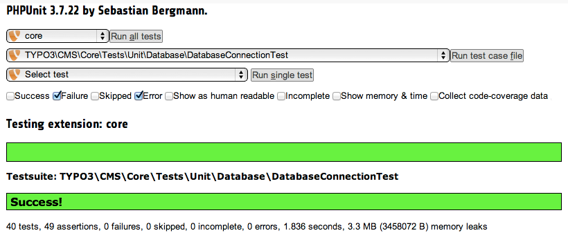

# Prototypischer Nachweis der Herstellbarkeit

## Konzeption des Prototypen
Bevor mit der Implementierung des Prototyps begonnen werden konnte, wurden die zu erreichenden Ziele definiert.  

\begin{itemize}
\item  Der Prototyp wurde als normale Extension konzipiert, die über das \textit{Install Tool} installierbar ist. Dies ist notwendig, da bereits bei der Installation das zu nutzende \gls{dbms} auswählbar sein muß. Er ist gegenfalls ohne größeren Aufwand in eine Systemextension umwandelbar

\item Der Prototyp soll die alte Datenbank API unterstützen, damit TYPO3 CMS und externe Extensions weiterhin funktionieren. 
\item Der Prototyp unterstützt MySQL als \gls{dbms}.
\item Die Methodennamen der neuen \gls{api} folgen den TYPO3 \gls{cgl}.
\item Die Erstellung der Basisdatenbank erfolgt durch Doctrine DBAL und nutzt dessen abstaktes Datenbankschema.
\item Die Der Prototyp führt eine \textit{Fluent Query Language} ein, damit auf die manuelle Formulierung von SQL Anfragen verzichtet werden kann.
\item Intern werden \textit{Prepared Statements} genutzt
\end{itemize}

Diese Anforderungen konnten anschließend in einzelne Teilaufgaben zusammengefasst werden:

\begin{enumerate}
\item Erhöhung der Testabdeckung der vorhandenen Datenbank API.
\item Erstellen der Grundstrukutur des Prototypen
\item Implementation einer Fluent \gls{api}
\item Umbau von TYPO3 CMS auf die \gls{api} des Prototypen
\end{enumerate}

Ein Großteil dieser Anforderungen ist erreichbar ohne eine Veränderung an TYPO3 CMS vorzunehmen, da die Extension lediglich die neue \gls{api} als ein Angebot darstellt. Ein massiver Eingriff in den Code von TYPO3 CMS stellt der Meilenstein 6 dar. Hier muß jede Datenbankfunktion auf die neue \gls{api} umgestellt werden. Bevor das jedoch geschehen kann, müssen minimale Anpassungen an der Installationsroutine von TYPO3 CMS vorgenommen werden. Dabei diente die Systemextension DBAL als Vorbild, da sie ebenfalls während der Installation installierbar sein muß.

### Vorbreitungen
### Installation von TYPO3
TYPO3 CMS wurde auf dem lokalen Rechner per \textit{GIT} in der Entwicklerversion 6.2.x-dev unter \url{thesis.dev} installiert. TYPO3 CMS 6.2 stellte die zum Zeitpunkt der Implementierung aktuelle Version dar. Die Entwicklerversion wurde gewählt, um von der fortlaufenden Weiterentwicklung des Systems zu profitieren. \textit{GIT} wurde verwendet, damit der Code einfacher aktualisierbar war und eigene Änderungen daran nachvollzogen und dokumentiert werden konnten. 

Abbildung~\ref{lst:thesisDevFolders} zeigt die Verzeichnisstruktur nachdem das System installiert und alle notwendigen Verzeichnisse und Symlinks erstellt wurden:

\begin{figure}
\begin{Verbatim}[samepage=true]
$ tree -L 2 --dirsfirst
.
├── http
│   ├── fileadmin
│   ├── typo3 -> typo3_src/typo3
│   ├── typo3_src -> ../typo3cms
│   ├── typo3conf
│   ├── uploads
│   └── index.php -> typo3_src/index.php
└── typo3cms
    ├── typo3
    ├── ChangeLog
    ├── GPL.txt
    ├── INSTALL.md
    ├── LICENSE.txt
    ├── NEWS.md
    ├── README.md
    ├── _.htaccess
    ├── composer.json
    └── index.php
\end{Verbatim}
\caption{Die Grundstruktur von \url{thesis.dev}}
\label{lst:thesisDevFolders}
\end{figure}

Das Verzeichnis \pdf{http} wurde per Eintrag in der Apache2 Konfiguration als VirtualHost definiert.

\begin{shcode}
<VirtualHost *:80>¬
DocumentRoot "~/Sites/thesis.dev/http"¬
ServerName thesis.dev¬
ErrorLog "~/Sites/thesis.dev/logs/error_log"¬
CustomLog "~/Sites/thesis.dev/logs/access_log" common¬
</VirtualHost>
\end{shcode}

TYPO3 CMS wurde nach \pdf{typo3cms} installiert, damit dessen Dateien nicht über den Apache ereichbar sind. 

Um die Installation unter der Adresse \url{thesis.dev} erreichen zu können, wurde in der Hostdatei ein A-Record angelegt.

\begin{shcode}
sudo sh -c "echo '127.0.0.1 thesis.dev' >> /etc/hosts"
\end{shcode} 

Im Anschluß daran wurde eine leere Datenbank mit dem Namen \texttt{thesis} erstellt:

\begin{shcode}
mysql -u root -p
MariaDB [(none)]> create database if not exists thesis;
Query OK, 1 row affected (0.01 sec)
	MariaDB [(none)]> quit;
\end{shcode}

Durch das Aufrufen von \url{http://thesis.dev/} im Browser wird der Installationsprozess gestartet, der in fünf Schritten das System installiert.

\subsection{Schritt 1 - Systemcheck}
	Im ersten Schritt (Abb.:~\ref{fig:installTYPO3LegacyStepOne}) prüft das \textit{Install Tool} ob alle Verzeichnisse und Symlinks angelegt wurden und die entsprechenden Benutzerrechte besitzen. Intern werden hier Verzeichnisse wie \pdf{typo3temp} und Dateien wie \pdf{LocalConfiguration} angelegt. 

\subsection{Schritt 2 - Eingabe der Datenbankdaten}
	Im zweiten Schritt (Abb.:~\ref{fig:installTYPO3LegacyStepTwo})werden die Benutzerdaten für die Datenbank eingegeben. Es kann hier zwischen einer Port- oder Socket-basierten Verbindung ausgewählt werden.

	Über den Button am Ende der Formulars wird – anstelle der nativen Datenbank API – die Systemextension DBAL genutzt, da TYPO3 CMS ein anderes \gls{dbms} nutzen soll. Die Exension wird daraufhin installiert und in ähnlicher Weise konfiguriert, wie es hier dargestellt wird. 

\subsection{Schritt 3 - Auswahl der Datenbank}
	Nachdem die Verbindungsdaten eingegeben wurden, versucht TYPO3 CMS sich mit dem \gls{dbms} zu verbinden. Gelingt dies, werden alle verfügbaren Datenbanken abgefragt und aufgelistet (Abb.:~\ref{fig:installTYPO3LegacyStepThree}). Über die Auswahl kann eine leere Datenbank festgelegt beziehungsweise kann über das Inputfeld eine zu erstellende Datenbank angegeben werden. Durch die Aktivierung der Schaltfläche werden die Basistabellen in der Datenbank angelegt.

\subsection{Schritt 4 - Einrichten eines TYPO3 Administrators}
	In 4. Schritt (Abb.:~\ref{fig:installTYPO3LegacyStepFour}) der Installation wird ein Administrator für die Seite eingerichtet und es kann ein Name für die Seite vergeben werden.

\subsection{Schritt 5 - Abschluß der Installation}
	Danach ist die Installation abgeschlossen und über die Schaltfläche kann das Backend aufgerufen werden (Abb.:~\ref{fig:installTYPO3LegacyStepFive})

	\begin{figure}[H]
		\begin{subfigure}[b]{0.5\textwidth}
			\includegraphics[width=\textwidth]{InstallingTYPO3/DoctrineDBAL/01-SystemEnvironmentCheck.png}
			\caption{Installation TYPO3 CMS - 1. Schritt}
			\label{fig:installTYPO3LegacyStepOne}
		\end{subfigure}%
		~ %add desired spacing between images, e. g. ~, \quad, \qquad, \hfill etc.
	%(or a blank line to force the subfigure onto a new line)
		\begin{subfigure}[b]{0.5\textwidth}
			\includegraphics[width=\textwidth]{InstallingTYPO3/Legacy/02-DatabaseConnectionLegacy.png}
			\caption{Installation TYPO3 CMS - 2. Schritt}
			\label{fig:installTYPO3LegacyStepTwo}
		\end{subfigure}
		~ %add desired spacing between images, e. g. ~, \quad, \qquad, \hfill etc.
	%(or a blank line to force the subfigure onto a new line)
		\begin{subfigure}[b]{0.5\textwidth}
			\includegraphics[width=\textwidth]{InstallingTYPO3/Legacy/03-SelectDatabaseLegacy.png}
			\caption{Installation TYPO3 CMS - 3. Schritt}
			\label{fig:installTYPO3LegacyStepThree}
		\end{subfigure}%
		~ %add desired spacing between images, e. g. ~, \quad, \qquad, \hfill etc.
	%(or a blank line to force the subfigure onto a new line)
		\begin{subfigure}[b]{0.5\textwidth}
			\includegraphics[width=\textwidth]{InstallingTYPO3/Legacy/04-CreateUserAndImportBaseDataLegacy.png}
			\caption{Installation TYPO3 CMS - 4. Schritt}
			\label{fig:installTYPO3LegacyStepFour}
		\end{subfigure}
		~ %add desired spacing between images, e. g. ~, \quad, \qquad, \hfill etc.
	%(or a blank line to force the subfigure onto a new line)
		\begin{subfigure}[b]{0.5\textwidth}
			\includegraphics[width=\textwidth]{InstallingTYPO3/Legacy/05-InstallationDoneLegacy.png}
			\caption{Installation TYPO3 CMS - 5. Schritt}
			\label{fig:installTYPO3LegacyStepFive}
		\end{subfigure}%
		\caption{Installation von TYPO3 CMS}
		\label{fig:installationOfTYPO3}
	\end{figure}

## Tests für die alte Datenbank API
Um zu gewährleisten, dass TYPO3 CMS sowohl mit der alten API - die von dem Prototypen zur Verfügung gesellt wird - als auch mit der neuen API kompatibel ist, müssen Untit Tests für die alte Datenbank API geschrieben werden. 

Zur Ausführung der Unit Tests wird die Extension \textit{PHPUnit} benötigt, welche das gleichnamige Testing Framework \textit{PHPUnit\footnote{\url{http://www.phpunit.de}}} zur Verfügung und einen einen graphischen Testrunner im Backend mitbringt. Sie wird über den Extension Manager installiert.

Die alte Datenbank API verfügt zur dem Zeitpunkt der Erstelltung des Prototypen über 40 Tests mit 49 Assertions, welche jedoch lediglich Hilfsmethoden testen. Abbildung~\ref{fig:testRunnerUnitTestDatabasConnectionLegacyBefore} und~\ref{fig:DatabasConnectionTestLegacyBefore} zeigen die Testabdeckung in Form des Testrunners und als UML Diagramm. Abbildung~\ref{fig:DatabasConnectionTestLegacyAfter} zeigt die gleiche Klasse mit den für den Prototypen implementierten Unit Tests.  

Es wurden 68 Tests für \phpinline{TYPO3\CMS\Core\Database\DatabaseConnection} zugefügt.

  
## Erstellung des Prototypen

### Stichpunkte

_Änderungen am Prototypen_

1. Extension Builder -> Extension erstellen √
3. Verzeichnis Classes/Persistence/Legacy erstellen √
4. Kopieren von DatabaseConnection.php und PreparedStatements.php in das Verzeichnis √
5. Verzeichnis Tests/Persistence/Legacy erstellen √
6. Kopieren von DatabaseConnectionTest.php und PreparedStatementTest.php in das Verzeichnis √
7. Namespaces anpassen Vendor\Extensionname\Persistence\Legacy √
8. Datei ext_localconf.php erstellen und XCLASSEN der beiden Dateien  √
9. Extension installieren √
10. Per Debuggen in der IDE feststellen, ob ByPass funktioniert √
12. Verzeichnis Classes/Persistence/Doctrine/ erstellen  √
13. Datei DatabaseConnection.php in dem Verzeichnis erstellen -> Datei erbt von Classes\Persistence\Legacy\DatabaseConnection.php √
14. Datei PreparedStatemetns.php in dem Verzeichnis erstellen -> Datei erbt von Classes\Persistence\Legacy\PreparedStatements √
16. \Classes\Persistence\Doctrine\DatabaseConnection.php bekommt die neuen Methoden, die auf die die alte API nutzen parent:: √
17. Syncron dazu die Tests schreiben √
18. Refactoring von connectDb() / connectDatabase() √
19. Testen durch Überschreiben von connectDb() in \Classes\Persistence\Doctrine\DatabaseConnection.php √

Die Grundstruktur des Prototypen wurde unter \pdf{thesis/http/typo3conf/ext/doctrine\_dbal} erstellt.

\begin{Verbatim}[samepage=true]
thesis.dev/http/typo3con/ext/
├── doctrine_dbal/
│   ├── Configuration/
│   ├── Resources/
│   ├── ext_emconf.php
│   ├── ext_icon.gif
│   └── ext_tables.php
\end{Verbatim}

Die Datei \pdf{ext\_emconf.php} enthält die Metainformationen der Extension, die von dem Extension Manager verarbeitet werden.

\begin{listing}
\begin{phpcode}
<?php
$EM_CONF[$_EXTKEY] = array(
	'title' => 'Doctrine DBAL',
	'description' => 'Doctrine DBAL Integration in TYPO3 CMS',
	'category' => 'be',
	'author' => 'Stefano Kowalke',
	'author_email' => 'blueduck@gmx.net',
	'author_company' => 'Skyfillers GmbH',
	'shy' => 0,
	'priority' => '',
	'module' => 'mod1',
	'state' => 'alpha',
	'internal' => 0,
	'uploadfolder' => 0,
	'createDirs' => '',
	'modify_tables' => '',
	'clearCacheOnLoad' => 0,
	'lockType' => '',
	'version' => '0.1.0',
	'constraints' => array(
		'depends' => array(
			'typo3' => '6.2.0-6.2.99',
		),
		'conflicts' => array('adodb', 'dbal'),
		'suggests' => array(
		),
	),
);
\end{phpcode}
\caption{Die Datei ext\_emconf.php}
\label{lst:extEmconf}
\end{listing}

Anschließend wurde Doctrine DBAL wurde über \textit{Composer} installiert, indem es als externe Abhängigkeit in der \pdf{composer.json} definiert und durch das Kommando \shinline{composer install} in den Ordner \pdf{vendor/doctrine} installiert wurde.

\begin{listing}
\begin{jsoncode}
{
	"name": "typo3/doctrine_dbal",
	"type": "typo3-cms-extension",
	"description": "This brings Doctrine2 to TYPO3",
	"homepage": "http://typo3.org",
	"license": ["GPL-2.0+"],
	"version": "6.2.0",
	"require": {
		"doctrine/dbal": "dev-master"
	},
	"mininum-stability": "dev",
}
\end{jsoncode}
\caption{Die Datei composer.json}
\label{lst:composer}
\end{listing}

Die Integration von Doctrine DBAL sollte so transparent für TYPO3 CMS und die Extensions erfolgen, dass weiterhin über die Methoden der alten API auf die Datenbank zugegriffen werden kann. Die alte API steht dabei vergleichbar einer Fassade vor der neuen API, die ankommende Anfragen selbst behandelt oder an die neue API delegiert. Dieses Vorgehen erlaubt die sukzessive Integration von Doctrine DBAL.

Dazu wurde

- im Ordner \pdf{doctrine\_dbal/Classes/Persistence/Doctrine} die Datei \pdf{DatabaseConnection.php} erstellt (im weiteren Verlauf als \textit{neue API} bezeichnet),
- die Datei \pdf{DatabaseConnection.php} aus der Codebasis von TYPO3 CMS in den Ordner \pdf{doctrine\_dbal/Classes/Persistence/Legacy} des Prototypen kopiert (im weiteren Verlauf als \textit{alte API} bezeichnet),
- die Datei \pdf{DatabaseConnectionTests.php} mit den neu implementierten Unit Tests aus der Codebasis von TYPO3 CMS in den Ordner \pdf{doctrine\_dbal/Tests/Persistence/Legacy} des Prototypen kopiert, 
- eine Vererbung realisiert, die die Klasse der alten API von der Klasse der neuen API erben lässt (siehe Abb:.~\ref{fig:oldAPIextendsNewAPI} und  
- die Klasse der alten API per XCLASS in der Datei \pdf{ext\_localconf.php} registiert (siehe Listing:.~\ref{lst:xclassDatabaseAPI}.

\begin{figure}[H]
    \centering
    \includegraphics[scale=0.5]{gfx/uml/NewAPI/OldDatabaseConnectionExtentsFromNewAPI.eps}
    \caption{Alte API-Klasse erbt von neuer API-Klasse}
    \label{fig:oldAPIextendsNewAPI}
\end{figure} 

\begin{listing}[H]
\begin{phpcode}
if (!defined('TYPO3_MODE')) {
	die('Access denied.');
}

$GLOBALS['TYPO3_CONF_VARS']['SYS']['Objects']['TYPO3\\CMS\\Core\\Database\\DatabaseConnection'] =
  array('className' => 'Konafets\\DoctrineDbal\\Persistence\\Legacy\\DatabaseConnection');
\end{phpcode}
\caption{Registrierung der XCLASSes in \pdf{doctrine\_dbal/ext\_localconf.php}}
\label{lst:xclassDatabaseAPI}
\end{listing}

Danach wurden alle Eigenschaften aus der alten API in die neue API verschoben und mit Setter/Getter-Methoden versehen, woraufhin die alte API angepasst wurde. Die Umstellung auf Doctrine begann mit dem Refactoring der Methode \phpinline{connectDB()} der alten API. Dabei wurde lediglich die Implementation der Methode vereinfacht, da sie unübersichtlich war und mehrere unterschiedliche Aufgaben ausführte, die nichts mit deren Aufgabengebiet - der Herstellung einer Verbindung zur Datenbank - gemein hatten.

Neben ihrer eigentlichen Aufgabe hast sie

\begin{itemize}
	\item einen Test durchgeführt, ob eine Datenbank konfiguriert ist
	\item die konfigurierte Datenbank ausgewählt und
	\item verschiedene Hooks ausgeführt
\end{itemize}

Code, der nicht zur definierten Aufgabe der Methode gehörte, wurde in eigene Methoden ausgelagert. Die Methode zur Überprüfung der veralteten Parameter konnte gänzlich entfallen, da die Änderungen an der neuen API stattfanden. Die Methode wurde anhand des aufgestellten Namensschemas umbenannt und wird von der alten Methode aufgerufen. Zusätzlich fängt die Methode nun die von Doctrine DBAL kommende Exception wenn keine Verbindung erstellt werden konnte und wirft eine eigene \phpinline{ConnectionException}. Die entsprechenden Exceptionklassen wurden in \pdf{doctrine\_dbal/Classes/Exeptions/} erstellt.

Listing~\ref{lst:connectDatabaseAfterRefactoring} zeigt die Methode nach dem Refactoring; Listing~\ref{lst:connectDBcallsConnectDatabase()} zeigt den Aufruf der neuen Methode.

\begin{listing}
\begin{phpcode}
public function connectDatabase($isInitialInstallationInProgress = FALSE) {
		// Early return if connected already
		if ($this->isConnected) {
			return;
		}

		if (!$isInitialInstallationInProgress) {
			$this->checkDatabasePreconditions();
		}

		try {
			$this->link = $this->getConnection();
		} catch (\Exception $e) {
			throw new ConnectionException($e->getMessage());
		}

		$this->isConnected = $this->checkConnectivity();

		if (!$isInitialInstallationInProgress) {
			if ($this->isConnected) {
				$this->initCommandsAfterConnect();
				$this->selectDatabase();
			}

			$this->prepareHooks();
		}
	}
\end{phpcode}
\caption{\phpinline{connectDatabase()} nach dem Refactoring}
\label{lst:connectDatabaseAfterRefactoring}
\end{listing}

\begin{listing}
\begin{phpcode}
	public function connectDB($host = NULL, $username = NULL, $password = NULL, $db = NULL) {
		// Early return if connected already
		if ($this->isConnected) {
			return;
		}

		if ($host || $username || $password || $db) {
			$this->handleDeprecatedConnectArguments($host, $username, $password, $db);
		}

		$this->connectDatabase();
	}
\end{phpcode}
\caption{\phpinline{connectDB()} delegiert an die neue API-Methode}
\label{lst:connectDBcallsConnectDatabase()}
\end{listing}

Die originale Implementation der Mehode ist in \pdf{typo3/sysext/core/Classes/Database/DatabaseConnection.php} ab Zeile 1578 zu finden.\footnote{https://github.com/Konafets/TYPO3CMSDoctrineDBAL/blob/master/typo3/sysext/core/Classes/Database/DatabaseConnection.php#L1578}

Die Erstellung der Verbindung wurde in der alten API an die Methode \phpinline{sql_pconnect()} ausgelagert. \phpinline{getConnection()} ist der Name der Methode die diese Aufgabe in der neuen API übernimmt.

Zunächst wurde Code, welcher nicht zum Aufgabengebiet der Methode gehört, in eigene Klassen ausgelagert. In dem Fall betraf das den Test nach einer installierten MySQLi PHP-Erweiterung, welcher im gleichen Zuge auf PDO geändert wurde.

Die Initialisierung von Doctrine erfolgt in einer eigenen Methode. Dort wird je eine Instanz von \phpinline{\Doctrine\DBAL\Configuration} und \phpinline{\Doctrine\DBAL\Schema\Schema}.

Die Methode der \phpinline{sql_pconnect()} der alten API bot die Möglichkeit einer persistenten Verbindung zur Datenbank. Dies wurde implementiert, in dem ein eigenes \phpinline{PDO}-Objekt mit dem Konstrukturparameter \phpinline{\PDO::ATTR_PERSISTENT => true} erstellt und in dem Konfigurationsarray gespeichert wurde.

Dieses Konfigurationsarray (siehe Listing~\ref{lst:DoctrineConfigArray}) wird \phpinline{\Doctrine\DBAL\DriverManager::getConnection()} übergeben.

\begin{listing}
\begin{phpcode}
	protected $connectionParams = array(
		'dbname'   => '',
		'user'     => '',
		'password' => '',
		'host'     => 'localhost',
		'driver'   => 'pdo_mysql',
		'port'     => 3306,
		'charset'  => 'utf8',
	);
\end{phpcode}
\caption{Das Konfigruationsarray für Doctrine DBAL}
\label{lst:DoctrineConfigArray}
\end{listing}

Zudem muß Doctrine DBAL der Datentyp \sqlinline{Enum} bekanntgemacht werden. Anschließend wird der Schema Manager erstellt, welcher zur Verwaltung des Datenbankschemas notwendig ist.

Am Schluß wird das Verbindungsobjekt zurückgegeben.

\begin{listing}
\begin{phpcode}
	/**
	 * Open a (persistent) connection to a MySQL server
	 *
	 * @return boolean|void
	 * @throws \RuntimeException
	 */
	public function getConnection() {
		if ($this->isConnected) {
			return $this->link;
		}

		$this->checkForDatabaseExtensionLoaded();

		$this->initDoctrine();

		// If the user want a persistent connection we have to create the PDO instance by ourself and pass it to Doctrine.
		// See http://stackoverflow.com/questions/16217426/is-it-possible-to-use-doctrine-with-persistent-pdo-connections
		// http://www.mysqlperformanceblog.com/2006/11/12/are-php-persistent-connections-evil/
		if ($this->persistentDatabaseConnection) {
			// pattern: mysql:host=localhost;dbname=databaseName
			$cdn = substr($this->getDatabaseDriver(), 3) . ':host=' . $this->getDatabaseHost() . ';dbname=' . $this->getDatabaseName();
			$pdoHandle = new \PDO($cdn, $this->getDatabaseUsername(), $this->getDatabasePassword(), array(\PDO::ATTR_PERSISTENT => true));
			$this->connectionParams['pdo'] = $pdoHandle;
		}

		$connection = DriverManager::getConnection($this->connectionParams, $this->databaseConfiguration);
		$this->platform = $connection->getDatabasePlatform();

		$connection->connect();

		// We need to map the enum type to string because Doctrine don't support it native
		// This is necessary when the installer loops through all tables of all databases it found using this connection
		// See https://github.com/barryvdh/laravel-ide-helper/issues/19
		$this->platform->registerDoctrineTypeMapping('enum', 'string');
		$this->schemaManager = $connection->getSchemaManager();

		return $connection;
	}
\end{phpcode}
\caption{\phpinline{getConnection() der neuen API}
\label{lst:getConnectionNewAPI}
\end{listing}

Nachdem durch Doctrine DBAL die Verbindung hergestellt werden konnte, wurde die Methode \phpinline{query()} der alten API übernommen. Sie stellt die zentrale Schnittstelle aller API-Methoden zum Senden ihrer Anfragen an die Datenbank dar. Sie kapselt die gleichnamige Methode \phpinline{PDO::query()}.

\begin{listing}
\begin{phpcode}
	protected function query($query) {
		if (!$this->isConnected) {
			$this->connectDatabase();
		}

		$stmt = $this->link->query($query);

		return $stmt;
	}
\end{phpcode}
\caption{\phpinline{getConnection() der neuen API}
\label{lst:getConnectionNewAPI}
\end{listing}

Wie bereits in Kapitel~\ref{sec:doctrine} erwähnt wurde, gibt \phpinline{query()} ein Statementobjekt zurück, welches die Ergebnismenge bereithält. Dort wurde ebenfalls dargestellt, dass diese Menge durch die Methode \phpinline{fetch()} in Verbindung mit PDO-Konstanten in Index-basierte oder Assoziative Arrays formatiert werden kann.

Um die Arbeit mit der Ergebnismenge zu erleichtern wurden die drei Methoden \phpinline{fetchAssoc($stmt)}, \phpinline{fetchRow($stmt)} und \phpinline{$fetchColumn($stmt)} implementiert, die die am Häufigsten vorkommenden  \textit{Fetch-Styles} kapseln.

\begin{phpcode}
	/**
	 * Returns an associative array that corresponds to the fetched row, 
	 * or FALSE if there are no more rows.
	 * Wrapper function for Statement::fetch(\PDO::FETCH_ASSOC)
	 *
	 * @param \Doctrine\DBAL\Driver\Statement $stmt A PDOStatement object
	 *
	 * @return boolean|array Associative array of result row.
	 * @api
	 */
	public function fetchAssoc($stmt) {
		if ($this->debugCheckRecordset($stmt)) {
			return $stmt->fetch(\PDO::FETCH_ASSOC);
		} else {
			return FALSE;
		}
	}

		public function fetchColumn($stmt, $index = 0) {
		if ($this->debugCheckRecordset($stmt)) {
			return $stmt->fetchColumn($index);
		} else {
			return FALSE;
		}
	}

		public function fetchRow($stmt) {
		if ($this->debugCheckRecordset($stmt)) {
			return $stmt->fetch(\PDO::FETCH_NUM);
		} else {
			return FALSE;
		}
	}
\end{phpcode}

Die ehemaligen \phpinline{admin_*}-Methoden wurden in \phpinline{list_*}-Methoden umbenannt, da die Unterscheidung in sogenannte Admin und Nicht-Admin Methoden nicht nachvollziehbar war. Diese Mehoden stellen wichtige Metainformation zur darunterliegenden Datenbank bereit, die nicht nur für das \textit{Install Tool} von Nutzen sind.

Als Beipiel der Abstraktion, die Doctrine DBAL mitbringt, sei die Implementation der Methode \phpinline{listDatabases()} angeführt.

Nach dem obligatorischen Verbindungstest, gibt der \phpinline{SchemaManager} eine Liste aller Datenbanken zurück - vollkommen unabhängig von der zugrundeliegenden \gls{dbms}.

\begin{phpcode}
	public function listDatabases() {
		if (!$this->isConnected) {
			$this->connectDatabase();
		}

		$databases = $this->schemaManager->listDatabases();
		if (empty($databases)) {
			throw new \RuntimeException(
				'MySQL Error: Cannot get databases: "' . $this->getErrorMessage() . '"!',
				1378457171
			);
		}

		return $databases;
	}
\end{phpcode}

Doctrine stellt zum Maskieren von Benutzereingaben die Methode \phpinline{\Doctrine\DBAL\Connection::quote()} bereit. Im Gegensatz zur alten API, dessen Methode ein Backslash (\\) zur den zu maskierenden Zeichen voranstellt, werden die Zeichen von Doctrine durch ein Hochkomma (') maskiert. Die Methode \phpinline{\Doctrine\DBAL\Connection::quote()} wurde in der neuen API durch eine gleichnamige Methode gekapselt und stellt die Basis für alle weitere Methoden wie \phpinline{fullQuoteString()}, \phpinline{fullQuoteArray()}, \phpinline{quoteString()} und \phpinline{escapeStringForLike()} dar, welche das Verhalten der alten Methoden implementieren. 

Die neue API bietet dagegen die Methoden \phpinline{quoteColumn()}, \phpinline{quoteTable()} und \phpinline{quoteIdentifier()} zum Maskieren an. Es kann weiterhin \phpinline{\Konafets\DoctrineDbal\Persistence\Doctrine\DatabaseConnection::quote()} genutzt werden; sicherer ist es jedoch von Anfang die Benutzung von Prepared Statements, welche von TYPO3 CMS seit Version 6.2 in Form eines Wrappers um die \textit{Prepared Statements} von MySQLi angeboten werden. Sie besitzen die gleichen API, wie sie in Kapitel~\ref{sec:doctrinePreparedStatemtens} vorgestellt wurde.

Durch den Aufruf der Methode \phpinline{$stmt = $GLOBALS['TYPO3_DB']->prepare($sql)} wird zunächst ein Objekt vom Typ \phpinline{\TYPO3\CMS\Core\Database\PreparedStatement} erstellt, dem der in \phpinline{$sql} gespeicherte Prepared Statemnt übergeben wird. Ein Aufruf von \phpinline{$stmt->bind(':lastName', 'Potter')} fügt einem internen Array des Objekts diese Werte hinzu. Zusätzlich wird versucht den Datentyp zu erkennen und ebenfalls zu speichern. Erst mit dem Aufruf von \phpinline{$stmt->execute()} wird die Datenbank kontaktiert. Zuvor wird jedoch erst die gespeicherte SQL-Anfrage und - die durch \phpinline{bind()} - übergebenen Parameter von \textit{Named Placeholder} in \textit{Positional Parameter} transformiert, da MySQLi nur diese unterstützt. Daraufhin wird die SQL-Abfrage über \phpinline{mysqli::prepare()} an die Datenbank gesendet. Danach werden die in dem Array gespeicherten  Parameter per \phpinline{mysqli::bind()} an die Abfrage gebunden und abschließend per \phpinline{mysqli::execute()} ausgeführt. Zur Definition des Datentypes und des \textit{Fetch-Styles} werden - analog zu PDO - Konstanten wie \phpinline{PreparedStatement::PARAM_INT} oder \phpinline{PreparedStatement::FETCH_ASSOC} verwendet.

Für die Umstellung auf Doctrine wurde die Datei \pdf{typo3/sysext/core/Classes/Database/PreparedStatement.php} in den Prototypen in das Verzeichnis \pdf{doctrine\_dbal/Classes/Persistence/Doctrine/} kopiert. Es wurden die eigens verwendeten Konstanten auf PDO-Konstanten umgemappt und die Transformation in \textit{Positional Parameter} wurde entfernt, da von Doctrine beide Varianten unterstützt.

\begin{phpcode}
	protected function guessValueType($value) {
		if (is_bool($value)) {
			$type = PDO::PARAM_BOOL;
		} elseif (is_int($value)) {
			$type = PDO::PARAM_INT;
		} elseif (is_null($value)) {
			$type = PDO::PARAM_NULL;
		} else {
			$type = PDO::PARAM_STR;
		}

		return $type;
	}
\end{phpcode}

## Prototyp installierbar über das Install Tool
Für eine Datenbankabstraktionsschicht ist es wichtig, dass sie bereits während der Installation verfügbar ist um ein alternatives \gls{dbms} nutzen zu können. Demnach muß der Prototyp - analog zur Systemextension DBAL - über das Install Tool installierbar sein, was zu geringfügigen Anpassungen am Install Tool führt. 

Wie bei der Installation von TYPO3 CMS zu sehen war, führt das Install Tool in fünf Schritten durch die Installation. Diese Schritte werden von Klassen zur Verfügung gestellt, die sich im Ordner \pdf{typo3/sysext/install/Classes/Controller/Action/Step} befinden. Sie werden über den StepController \pdf{typo3/sysext/install/Classes/Controller/Action/StepController} gesteuert. Dabei iteriert der Controller bei jedem Reload des Installtools über alle Schritte und prüft ob der jeweils aktuelle Schritt bereits ausgeführt wurde oder noch ausgeführt werden muß. Der Controller erkennt dies an Bedingungen, die von jedem Schritt definiert werden.
Sind alle Bedingungen erfüllt, findet ein Redirekt auf den nächsten Schritt statt.

Die Ausgabe der Schritte erfolgt über verschiedene HTML-Template Dateien, die in der TYPO3 eigenen Template-Sprache \textit{Fluid} verfasst sind. Das Install Tool setzt hier das \gls{mvc}-Pattern ein, um die Geschäftslogik von der Präsentation zu trennen.

Die HTML-Templates unterteilen sich in \textit{Layouts}, \textit{Templates} und \textit{Partials}, die in den jeweilig gleichnamigen Verzeichnissen in \pdf{typo3/sysext/install/Resources/Privat/} zu finden sind. 

- Ein Template beschreibt die grundlegende Struktur einer Seite. Typischerweise befindet sich darin der Seitenkopf und -fuß. 
- Die Struktur einer einzelnen Seite wird von einem Template festgelegt. 
- Partials stellen wiederkehrende Elemente einer Seite dar. Sie können in Layout- und Templatedateien eingebunden werden. Die Schaltfläche \textit{I do not use MySQL} aus Abbildung~\ref{fig:installLegacyTwo} im zweiten Schritt ist ein Beispiel eines Partials.

Dieser Schritt stellt zudem den Anfangspunkt der Anpassungen dar. Es wurden zwei Partials erstellt und in das Template des Schrittes eingebunden. Das erste Partial stellt eine Schaltfläche dar, über die der Prototyp installiert werden kann, während das zweite eine Schaltfläche zur Deinstallation bereitstellt. \textit{Fluid} entscheidet anhand der Bedingung \mono{isDoctrineEnabled} welches der beiden Partials angezeigt wird. 

\begin{htmlcode}

	TYPO3 CMS native database implementation is based on mysql. This feature installs Doctrine DBAL and its experimental at the moment. Use it at your own risk and when you know what you are doing.

<form method="post">
	<f:render partial="Action/Common/HiddenFormFields" arguments="{_all}" />
	<input type="hidden" value="execute" name="install[set]" />
	<input type="hidden" value="1" name="install[values][loadDoctrine]" />
	<button type="submit">
		I want use Doctrine DBAL
		&nbsp;
	</button>
</form>
\end{htmlcode}

\begin{htmlcode}
			<f:if condition="{isDoctrineEnabled}">
				<f:then>
					<f:render partial="Action/Step/DatabaseConnect/UnloadDoctrineDbal" arguments="{_all}" />
				</f:then>

				<f:else>
					<f:render partial="Action/Step/DatabaseConnect/ConnectDetails" arguments="{_all}" />
					<f:render partial="Action/Step/DatabaseConnect/LoadDoctrineDbal" arguments="{_all}" />
					<f:render partial="Action/Step/DatabaseConnect/LoadDbal" arguments="{_all}" />
				</f:else>
			</f:if>

\end{htmlcode}

Damit die Bedingung \mono{isDoctrineEnabled} einen Wert enthält, muß diese von der Action des Schrittes definiert und an die View übergeben werden. In diesem Fall ist dafür die Klasse \phpinline{\TYPO3\CMS\Install\Controller\Action\Step\DatabaseConnect} zuständig. Hier wird der Extension Manager gefragt, ob der Prototyp installiert ist. 

\begin{phpcode}
$isDbalEnabled = \TYPO3\CMS\Core\Utility\ExtensionManagementUtility::isLoaded('doctrine_dbal');

$this->view
  ->assign('isDoctrineEnabled', $isDoctrineEnabled)
  ->assign('username', $this->getConfiguredUsername())
  ->assign('password', $this->getConfiguredPassword())
  ->assign('host', $this->getConfiguredHost())
  ->assign('port', $this->getConfiguredOrDefaultPort())
  ->assign('database', $GLOBALS['TYPO3_CONF_VARS']['DB']['database'] ?: '')
  ->assign('socket', $GLOBALS['TYPO3_CONF_VARS']['DB']['socket'] ?: '');
\end{phpcode}

An diesem Beispiel wird zudem deutlich wie die Zuweisung einer – in PHP definierten – Variable an die View realisiert wird.

Durch den Klick auf die neu hinzugefügte Schaltfläche wird der Prototyp installiert. Dazu wird der per POST-Request gesendete Wert \mono{loadDoctrine} von dem gleichen Schritt auswertet und per Extension Manager installiert (Siehe \pdf{typo3/sysext/install/Classes/Controller/Action/Step/DatabaseConnect.php} Zeilen 59-63 und 815-844). Daraufhin erhält der Benutzer ein visuelles Feedback, dass der Protoyp installiert wurde. Der weitere Verlauf der Installation ist mit der aus Kapitel~\ref{subsec:InstallingTypo3} dargestellten Installation identisch.

### Stichpunkte
21. vendor/doctrine nach Packages/Library kopieren √
23. Manuelles Editieren der PackageStates.php -> 'state' => 'active' auf active setzen
24. ggf. Reihenfolge in PackagesStates.php anpassen 

Die von Composer erstellte \textit{Autoload}-Datei, muß von TYPO3 CMS in die Datei \phpinline{\TYPO3\CMS\Core\Core\Bootstrap} eingebunden werden, damit die von Doctrine DBAL zur Verfügung gestellten Klassen geladen werden können.

\begin{listing}
\begin{phpcode}
	/**
	 * Initializes the Class Loader
	 *
	 * @return Bootstrap
	 * @internal This is not a public API method, do not use in own extensions
	 */
	public function initializeClassLoader() {
		/** Composer loader */
		require_once PATH_typo3conf . 'ext/doctrine_dbal/vendor/autoload.php';

		$classLoader = new ClassLoader($this->applicationContext);
		...
	}
\end{phpcode}
\caption{Einbinden der von Composer erstellten Autoloaddatei}
\label{lst:composerAutoload}
\end{listing}   

Der Installationsprozess wurde dahingehend angepasst, dass nach Installation des Prototyps zunächst ein Auswahlfeld erscheint, über das das zu verwendende \gls{dbms} festgelegt wird.

Das dynamisch erzeugte Feld besteht aus einem Partial. Es enthält die vom Install Tool gefundenen Datenbanktreiber. Der Codeteil ist in der Datei \pdf{typo3/sysext/install/Classes/Controller/Action/Step/DatabaseConnect.php} ab Zeile 606 zu finden.

Nach der Auswahl des Datenbanktreibers werden die Inputfelder eingeblendet. Da die verschiedenen \gls{dbms} unterschiedliche Daten für den Aufbau einer Verbindung zur Datenbank benötigen, ist die Anzahl und Art der Felder von dem ausgewählten Treiber abhängig. Der Codeteil ist in der Datei \pdf{typo3/sysext/install/Classes/Controller/Action/Step/DatabaseConnect.php} ab Zeile 556 zu finden. Abbildung~\ref{fig:sqlCredentials} zeigt die  Felder für MySQL. 

 
Generell wurde das Eingabefeld für die Datenbank entfernt, da diese im nächsten Schritt ausgewählt wird. Hinzugefügt wurde neben den schon erwähnten Auswahlfeld für die Datenebanktreiber, das Eingabefeld für das Datenbank Charset.

Damit die eingebenen Daten weiterverarbeitet werden konnten wurden diese in der Datei \phpinline{\TYPO3\CMS\Install\Controller\Action\Step\DatabaseConnect} ergänzt. Dort werden sie auch permanent in der Konfigurationsdatei pdf{thesis.dev/http/typo3conf/LocalConfiguration.php} gepeichert.

\begin{listing}
\begin{phpcode}
if (!empty($postValues['database'])) {
  $value = $postValues['database'];
  if (strlen($value) <= 50) {
    $localConfigurationPathValuePairs['DB/database'] = $value;
  }
}
\end{phpcode}
\end{listing}

Die in den Formularen eingegeben Datenbankinformationen werden über POST Variablen an das Install Tool gesendet und anschließend in der Konfigurationsdatei \pdf{thesis.dev/http/typo3conf/LocalConfiguration.php} gepeichert. Während der Laufzeit stehen sie entweder in dem Array \phpinlin{$postValues} oder in dem globalen Array \phpinline{$GLOBALS['TYPO3_CONF_VARS']['DB']} zur Verfügung. Bevor diese Werte verwendet wurden, wurde im Orignalcode per \phpinline{isset()} geprüft, ob sie vorhanden sind. Dies schließt jedoch nicht aus, dass die Variablen leer sind. Als Folge dessen wird ein leerer Wert übergeben. Als Beispiel sei die Möglichkeit der Wahl zwischen einer Socket basierten Datenbankverbindung oder einer Verbindung per Port erwähnt. Da beide Eingabefelder im HTML Code definiert und per htmlinline{name}-Attribut ein Variable zugewiesen bekommen haben, die per POST-Request an das Install Tool gesendet werde, wertet PHP diese Variable als gesetzt und verarbeitet speichert einen leeren Wert für den Port. Um das zu verhindern, wurden an allen notwendigen Stellen der Aufruf von \phpinline{isset()} zu \phpinline{!empty()} geändert. Diese fand in den Klassen \phpinline{\TYPO3\CMS\Core\Core\Bootstrap}, \phpinline{\TYPO3\CMS\Install\Controller\Action\Step\DatabaseConnect} und \phpinline{\TYPO3\CMS\Install\Controller\Action\Step\DatabaseSelect} statt.

Die vollständigen Änderungen an TYPO CMS können unter folgender Adresse nachvollzogen werden:

- typo3/sysext/core/Classes/Database/DatabaseConnection.php \url{https://github.com/Konafets/TYPO3CMSDoctrineDBAL/commit/a8fd161cf660974e1435f37b82a0e6f86f000e05}

## Konvertierung der *.sql Datein in das Doctrine Schema

_Änderungen am Prototypen_

1.

_Änderungen am TYPO3 CMS_

1.

## Implementierung einer Fluenten Query API

_Änderungen am Prototypen_

1.

## Nutzen der Fluenten Query API im Core

_Änderungen am TYPO3 CMS_

1.

## Testgetriebene Entwicklung der neuen API

### Implementierung der neuen API
- Anlegen der Klassen (Geschäftslogik und Testklassen)
- Implementation der Methoden und 
- Aktivierung der neuen API
- Schemakonvertierung
- Fluent API
- Query Builder 
  - Erklärung
  - Beispiele
- Facade Pattern
  - Erklärung
  - Beispiele
  - UML 
  - Query Builder 
- verschiedene Ansätze
  - Constraint Objekte wie in Extbase
  - …
  - schlußendlich Inspiriert von EzPublish
    - GitHub 
- echte Query Objekte
  
   
### Installation der Extension
- Vorher / Nachher Bilder von Installprozess
- 

### Benutzung der Extension
- transparent im Backend
- Beispiele der API
- Migration einer alten Funktion auf die Neue API

### Probleme
- Probleme mit Postgres
  - BLOB -> Dateistream
- TYPO3 Compare Tool
  
### Eigenheiten von Doctrine
- boolean -> tinyint(1)
- auto_increment + Default null

## Ideen

- TCA Ablösung in Form von YAML / XML / JSON

Stefano Kowalke
SteKo
soko
fanoo
noco
noko

 
 
